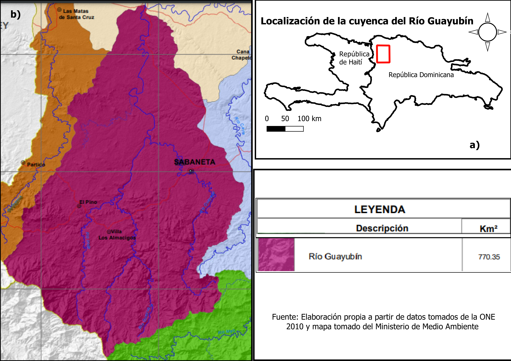
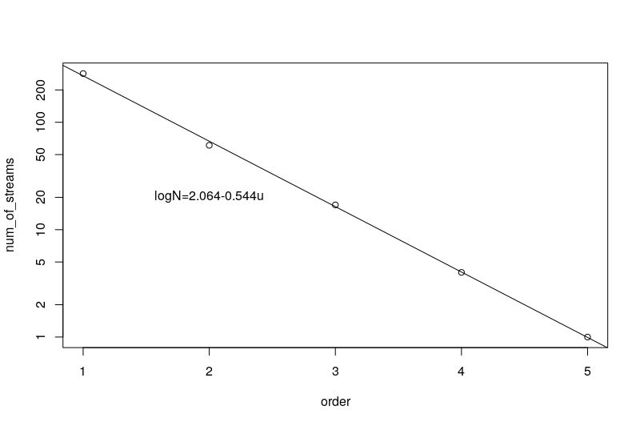

# Introducción
Desde hace siglos atrás el hombre ha buscado la manera de explicar y entender las distintas formas que el paisaje terrestre (relieve) posee. Autores numerosos han investigado la génesis de estas nociones geomorfológicas, remontándose a tres siglos atrás. Autores como Hutton, Playfair y Lyell, sirvieron de antecesores o bases para la ciencia geomorfológica. Tras su consolidación como ciencia en Francia numerosos autores fueron demostrando la importancia de esta ciencia, incluso ramificándola (climática, eólica, litoral, glaciar, estructural, tectónica, kárstica y fluvial; siendo la última de interés para esta investigación), para mayor eficacia en sus estudios.

Los estudios en la geomorfología fluvial a nivel mundial son numerosos y han servido para explicar cómo los drenajes de los ríos y sus redes hidrográficas son importantes para la geomorfología, ya que estas redes fluviales son parte de los procesos de modelado más activos en la formación del relieve y que permiten mensurar la configuración del mismo.
Para los estudios en geomorfología fluvial, se hace uso del análisis morfométrico de cuencas hidrográficas. La morfometría de cuenca se ha convertido en la técnica cuantitativa para el estudio de las cuencas de manera detallada y ordenada. Actualmente en la República Dominicana el uso del análisis morfométrico para estudiar cuencas hidrográficas es poco e insuficiente, a pesar de que la República Dominicana goza de una diversa y extensa red de cuencas hidrográficas, ricas y aprovechables para la aplicación de diversas técnicas con el fin de explicar y entender las propiedades del relieve y su relación con las cuencas fluviales. Por lo que, este estudio es un aporte para dar a conocer la configuración y modelado de la cuenca hidrográfica del rio Guayubín, con el fin de fijar parámetros que permitan evaluar esta cuenca fluvial; identificando el aspecto general de la cuenca y de la red, el orden de red y análisis hortoniano, los perfiles longitudinales e índice de concavidad de cursos más largos, y la morfometría de cuenca.
En ese mismo orden es imprescindible conocer el concepto de cuenca fluvial o de drenaje, que no es más que el conjunto de cuerpos de agua con un área determinada que fluyen por distintos canales y escurren en un mismo desagüe. Según los autores Gregory y Walling, 1973; y Chorley, 1969 (como citó @gutierrez2008geomorfologia), una cuenca fluvial compone el espacio determinado en el que se suministran las aguas que discurren por la superficie, el mismo está delimitado tanto por su relieve y su hidrología. También considerada como una unidad imprescindible en geomorfológica.

## Revisión bibliográfica 
Aspecto general de la cuenca y de la red

El aspecto general de la cuenca y de la red se refiere a los parametros hidrogrñaficos que posee la cuenca (la acumulación de flujos y cálculo de su umbral, elevación, depresión, y otros). Según @castillo2015delimitacion, la acumulación de flujos señala a todas las celdas que desaguan en una en particular, la misma se adquiere partiendo de la dirección de la corriente o flujo. @venkatachalam2001automatic dicen que la acumulación de flujo de una celda se instituye de acuerdo a la sumatoria de los valores de la acumulación de flujo de las celdas proximas que drenan en ella.En cuanto al umbral, según @ESRI2012, se es necesario un raster de acumulación de flujo y la `porción mínima de celdas que componen una corriente de agua. También se refiere a la forma que adquiere la cuenca y a la forma de su red de drenaje, según la conformación de sus ríos y el material rocoso que la compone (patrones de drenaje). Varios autores expresan que existe una conexión entre la estructura que posee la red de drenaje con el material rocoso (@pedraza1996geomorfologia, @gutierrez2008geomorfologia, @howard1967drainage, @gregory1973drainage). 

Orden de red y análisis hortoniano

El orden de red hace referencia al orden en el que se clasifican los cursos de agua, todo en base a su ramificación. Según @wikipedia2020stream, el orden de un curso de agua es siempre un número entero positivo que se usa tanto en Geomorfología como en Hidrología para denotar la magnitud de ramificación que posee una red fluvial.
Para @bowden1964effect, el orden de red sostiene una relación entre las rocas con la configuración de la red fluvial y con los procesos tanto hidrológicos como erosivos.
La clasificación de la red se hace de manera jerárquica. Hoy día existen múltiples normas para determinar la jerarquía de una red: Strahler (1952), Horton (1945), Shreve (1967), Scheidegger (1970), Leopold et al. (1964) Hack (1957) y Topological. 

Dice @pinilla1993symposium que para los años 40 el análisis hortoniano habia sentado las bases de lo que hoy es la morfometría fluvial; por lo que la aplicación del analisis hortoniano al estudio de cuencas hidrográficas son imprecindibles. Para @horton1945erosional, la razón de bifurcación resulta ser la conexión entre el número de redes fluviales de una jerarquía asignada entre el número de redes de jerarquía mayor próxima.

Perfiles longitudinales e índice de concavidad de cursos más largos

El perfil longitudinal de un curso de agua es una línea adquirida al representar las diversas alturas que se presentan desde el nacimiento de este hasta donde desagua (@gutierrez2008geomorfologia). Según @pedraza1996geomorfologia, por medio de los perfiles longitudinales es posible fundamentar definiciones en segmentos con geometría heterogénea (cóncavo, convexo y rectilíneo), o pendiente; las acomodaciones para cada parte a una función matematica; e incluso análisis geométricos basados en elementos físicos o evolutivos. @gutierrez2008geomorfologia, dice que el perfil longitudinal es generalmente cóncavo, aunque esta concavidad no está clara para muchos cursos fluviales. En cuanto al índice de concavidad, este no es más que un indicador que hace posible la evaluación del nivel de torcedura o curvatura del perfil longitudinal (@garzonmorfologia). Se calcula así, la superficie debajo del perfil longitudinal es extraída del total del área debajo del segmento que conecta los dos límites del perfil (@goldrick2007regional).

Morfometría de cuenca

El análisis morfométrico abarca un conjunto de índices morfológicos que apuntan a un análisis detallado y cuantitativo de cuencas hidrográficas (@morais2010geomorfologia). El análisis morfométrico de cuencas hidrográficas se inicia por la ordenación de canales fluviales, con la finalidad de establecer una jerarquía fluvial. Esta, a su vez, consiste en el proceso de establecer la clasificación de determinado curso de agua (o el área drenada que le pertenece) en el conjunto total de la cuenca hidrográfica en la que se encuentra. Aunque, según el autor, esto se logra con la función de facilitar y volver más objetivos los estudios morfométricos sobre las cuencas hidrográficas (@christofoletti1988geomorfologia). En cuanto a la curva hipsométrica de una cuenca @strahler1952hypsometric dice que el porcentaje de la curva hipsométrica no es mas que la relación entre el área de la sección diagonal horizontal de una red de drenaje con una altitud relativa sobre la boca de la cuenca, e incluso estas curvas pueden ser explicadas y relacionadas a través del uso de parámetros bidimensionales. Y referenter a la integral Hipsométrica, @fernandez2016analise expresa que el cálculo de este índice mide como está distribuida la altitud del en una cuenca fluvial.

Este estudio proporciona nueva información sobre la cuenca del río Guayubín en el campo de Morfometría fluvial, sabiendo que este es el primer estudio morfométrico que se realiza a la cuenca; y además este posee un script el cual permite su reproducción sin coste alguno.
En específico, se indaga en el aspecto general de la cuenca y de la red, el umbral de acumulación de flujo en numero de celdas, la forma que posee la cuenca y su red de drenaje, considerando la relación que tiene la forma de la cuenca y la forma de su red de drenaje con el material rocoso y el relieve (hidrología-topografía-litología). 
También, en el orden de red y la implementación del analisis hortoniano se tiene interes en la forma en la que se organiza o clasifica el orden de red asignado a cada curso fluvial en la cuenca, así como la razón de bifurcación de los órdenes de red fluvial. 
En cuanto a los perfiles longitudinales y sus indices de concavidad se estudia la geometría que posee cada segmento de los cursos, en este caso el de los más largos; tomando en consideración las diversas alturas presentes en el curso. Y, por último, nos interesa examinar la cuenca de forma cuantitativa, para conocer sus medidas básicas (área, perímetro, numero de orden de redes, pendiente, etc.).
El interés de este estudio es indar e interpretar lo siguiente: rango de umbral de acumulación, forma de la cuenca, forma de su red de drenaje, fenómenos que pueden afectar a la cuenca, si existe un patrón en la cuenca acorde a su red drenaje, si existe la relación litología-perfil longitudinal e índice de concavidad de los cursos de aguas más largos, y, por último, conocer la relación de las características litológicas y estructurales de la cuenca. 

# Área de estudio
La cuenca del río Guayubín se encuentra entre las morforegiones Cordillera Central y Valle del Cibao Occidental, en la República Dominicana (latitud 19.46$^\circ$N, longitud -71.41$^\circ$W), entre las provincias Santiago Rodríguez, Monte Cristi y Dajabón. En la provincia Dajabón engloba de forma completa el municipio El Pino, y de manera parcial los municipios Loma de Cabrera y Partido; en la provincia Monte Cristi contiene parcialmente los municipios Las Matas de Santa Cruz y Guayubín; y en la provincia Santiago Rodríguez comprende los municipios Villa Los Almácigos y San Ignacio de Sabaneta. Los munipicpios más poblados en el interior de la cuenca son Guayubín (35,923 hab.), San Ignacio de Sabaneta (34,540 hab.), y Loma de Cabrera (15,624 hab.). (ver figura \ref {mapacuenca})

La cuenca del río Guayubín, según @Mmar2015cuenca, abarca una área de 770.35 km\textsuperscript{2}. 
De acuerdo con el mapa de @Mmar2015cuenca, la cabecera del rio Guayubín se ubica en la vertiente noroeste de el Cerro La Pelada, en un paraje denominado Palo Amarillo; mientras que sus aguas se vierten en el río Yaque del Norte, localidad Guayubín. 

{width=90%}

# Materiales y Metodología
Para el estudio morfométrico de la cuenca Guayubín se usó softwares de código abierto como medio para procesar datos estadísticos y modelos digitales con la finalidad de generar las informaciones ha analizar e interpretar.

## Materiales

|           Materiales          	|                                                                                                                      Uso                                                                                                                     	|
|:-----------------------------:	|:--------------------------------------------------------------------------------------------------------------------------------------------------------------------------------------------------------------------------------------------:	|
|            RStudio            	| donde se redactó el manuscrito, se procesaron los datos que ofrece el DEM de la cuenca a traves de un script en el que se usaron paquetes que produjeran los resultados.                                                                     	|
|        library rgrass7        	| es una interfaz que permite establecer una conexión entre la version 7 del sistema de infromacion geográfica GRASS, y R, que crea un entorno GRASS desechable dentro de R.                                                                   	|
|           library sp          	| este paquete sirve para la importación, manipulación y exportación de datos espaciales en R, y para métodos que incluyen imprimir / mostrar, trazar, entre otros.                                                                            	|
|           library sf          	| crea caracteristicas simples (simple features), que amplían los objetos tipo data.frame con una columna de lista de características simples.                                                                                                 	|
|         library raster        	| este paquete proporciona clases y funciones para manipular datos geográficos (espaciales) en formato 'ráster'.                                                                                                                               	|
|        library leaflet        	| esta función crea un widget de mapa de folletos utilizando htmlwidgets. El widget se puede representar en páginas HTML generadas a partir de R Markdown, y otros.                                                                            	|
|         library leafem        	| es un paquete que provee una extensión para leaflet uasados para paquetes mapview, permite mostrar las coordenadas de la posición del puntero del mouse, consultar valores de imagen a través de puntero del mouse y botones de zoom a capa. 	|
|        library mapview        	| el paquete proporciona funcionalidad para ver objetos espaciales de forma interactiva.                                                                                                                                                       	|
|         library readr         	| el objetivo de 'readr' es proporcionar una forma rápida y amigable de leer datos rectangulares (como 'csv', 'tsv' y 'fwf').                                                                                                                  	|
|        QGIS with GRASS        	| para la visualización de vectores y rasters generados con RStudio en una región de GRASS,como la visualización de los mapas Topológicos y Geológicos de la República Dominicana, tambien, para la creación de algunos mapas de localización. 	|
|          Google Earth         	| para observar datos en formato kml generados y exportados de RStudio y asi como la representacion del relieve del lugar de estudio.                                                                                                          	|
|     Mapa Topológico de RD     	| para hacer comparaciones y obtener referencias sobre el relieve.                                                                                                                                                                             	|
| Mapa Geológico Nacional de RD 	| para hacer comparaciones y obtener referencias sobre la composición rocosa y los años que datan estas.                                                                                                                                       	|

## Metodología
Aspecto de la cuenca y de la red de drenaje.
Los parametros de la cuenca fueron calculados por medio de el addon de GRASS GIS `r.watershed` (@watershedcharles), utilizando un Dem. Los parametros calculados fueron acumulación, elevación, depresión, drenaje, flujo, cuenca y media cuenca, con un umbral de acumulación de flujo de 80 celdas necesarias para que exista una red de agua. Luego, las capas generadas fueron ingresadas a R con la `libreria sp` y manejadas con la `libreria raster`.
Se usó el addon `r.water.outlet` (@wateroutlet) para la extraccion de la cuenca se usaron los parametros siguientes: de entrada un mapa de direccion de drenajes (creado con el addon `r.watershed`), de coordenadas de desembocadura de la cuenca (obtenidas con `Mapview`), y de salida el nombre de la cuenca. Asi mismo, se usó el addon `r.to.vect` (@tovect), para convertir el raster resultante en vectorial, con los parametros a continuación: de entrada el mapa raster de la cuenca, de salida el nombre del vectorial y para la característica de salida se usó el área. Al final de la operación los resultados fueron llevados a R.
Para estraer la red de drenaje se aplico el addon `r.stream.extract` (@streamnextractmarkus), usando los parametros: elevación, umbral de acumulación, mapa raster de flujos y mapa vectorial de flujos. Luego los resultados de este procedimiento fueron llevados a R.

En cuanto al orden de red y el analisis hortoniano, se usó el addon `r.stream.extract` (@streamnextractmarkus), para producir un mapa de dirección de flujo con los parametros: de entrada un modelo de elevación, un umbral de acumulación y de sálida el nombre del mapa. Para la creación de mapas de ordenes de redes generados con `r.stream.order` (@streamorder) se usaron los parametros: de entrada un mapa raster de red de arroyos, un modelo de elevación, un mapa de direccion de flujos, un mapa de acumulación, de sálida un vector con todos los atributos de los fliujos, y a sálida de los vectores con los ordenes de redes según Strahler, Horton, Shreve, Hack y Topo.
Para analizar el orden de red de la cuenca se utilizó la clasificación de Strahler. Mientras que se usaron los addons `r.info` para obtener los valores minimos y maximos del orden de red segun Strahler; para delimitar la cuenca a traves de la red de drenaje se utilizo `r.stream.basins` (@streambasinsjareck), los parametros usados son: de entrada un mapa de direccion de flujos, un mapa mascara de flujos, rango de valores de categorias, y de sálida el nombre del mapa.
En cuanto a las estadisiticas según so orden de red de Horton para las redes de Strahler y Horton se uso el addon `r.stream.stats` (@streamstats), los parámetros a usados fueron: de entrada un  raster de red de arroyos, un raster de dirección de flujos, un modelo de elevación y de sálida el nombre del archivo.

Índices de concavidad y perfiles longitudinales.
Para calcular los indices de concavidad y los perfiles longitudinales, primero, se obtuvieron los cursos mas largos de la cuenca a traves de la funcion `LfpNetwork` (@lfpnetjose), usando coordenadas de desembocadura de la cuenca obtenidas con `Mapview`, vectores de ordenes de red, mapa de flujo de dirección y un sufijo de para los resultados que se generen.
Segundo, para producir los perfiles longitudinales e indices de cocavidad se empleo la función `LfpProfilesConcavity` (@lfpconcajose), utilizando como parámetro la red de cursos de agua más largos, coordenadas de desembocadura, un dem, un mapa de flujos de drenaje, un prefijo, un sistema de referencia de coordenadas, un parametro de suavizado y un número de filas de los perfiles.

Morfometría de cuenca.
Para la obtención de los parámetros morfométricos de la cuenca se uso el addon `r.basin` (@basinmargherita), por medio de un modelo de elevación y coordenadas proyectadas de la salida de la cuenca, obtenidas en geograficas con `Mapview` y transformadas a proyectadas con la funcion `My_Trans` (@Mytransjose). 

Respecto al cálculo de la curva e integral hipsométrica, se utilizó la función `HypsoIntCurve` (@Hypsocjose), a través de vectores de arroyos de cuenca de orden 2 y 3.

# Resultados
Aspecto general de la cuenca y de la red de drenaje. 
Tras cálcular los parámetros hidrograficos de la cuenca con `r.watershed` se obtuvo tres grupos de capas (DEM, basins y str), que con la ayuda de `leaflet` se generó un mapa que muestra las subcuencas, las redes fluviales y el DEM, de la cuenca sin delimitar. La cuenca extraida con `r.water.outlet` produjo un raster de cuenca delimitada que se transformó a vector con `r.to.vect`. En cuanto a la red de drenaje extraida con `r.stream.extract` se generó un raster y un vector con redes fluviales formadas a partir de un umbral de 80 celdas.

Orden de red analisis hortoniano
Con `r.stream.extract` se crearon mapas basados en las clasificaciones de Strahler, Horton, Shreve, Hack y Topo. Se ordenó y clasificó cada tramo fluvial de la cuenca según Strahler donde el orden máximo de red es 5 y el minimo es de 1. Según la clasificación de Strahler usada para analizar la red, obtenidas con `r.stream.stats`, se produjeron 367 redes fluviales de las cuales 284 redes eran de orden 1, mientras que de orden 2 se produjeron 61 redes, 17 redes de orden 3, 4 redes de orden 4, y 1 red de orden 5. (ver figura\ref {grafnro}).

{width=80%}

En cuanto al área de cuenca resultante de esta operación fue de 773.2235 km\textsuperscript{2}. De manera mas detallada los resultados del area de cuenca encontrados segun orden de red fueron los siguientes:

| Orden 	| Area total (km\textsuperscript{2}) 	|
|:-----:	|:----------------:	|
|   1   	|     488.1383     	|
|   2   	|     444.7173     	|
|   3   	|     539.4576     	|
|   4   	|     590.9969     	|
|   5   	|     773.2235     	|

Mientras que los resultados de la razón de bifurcación obtenidas para de cada orden de red fueron:

| Orden 	| Razón de Bifurcación 	|
|:-----:	|:--------------------:	|
|   1   	|        4.6557        	|
|   2   	|        3.5882        	|
|   3   	|        4.2500        	|
|   4   	|        4.0000        	|
|   5   	|        0.0000        	|

# Discusión

De acuerdo con el s.a. (s.f.), la cabecera del rio
Guayubin se ubica en las inmediaciones de loma escondida 

# Agradecimientos

# Información de soporte

# *Script* reproducible

# Referencia