# Introducción
Desde hace siglos atrás el hombre ha buscado la manera de explicar y entender las distintas formas que el paisaje terrestre (relieve) posee. Autores numerosos han investigado la génesis de estas nociones geomorfológicas, remontándose a tres siglos atrás. Autores como Hutton, Playfair y Lyell, sirvieron de antecesores o bases para la ciencia geomorfológica. Tras su consolidación como ciencia en Francia numerosos autores fueron demostrando la importancia de esta ciencia, incluso ramificándola (climática, eólica, litoral, glaciar, estructural, tectónica, kárstica y fluvial; siendo la última de interés para esta investigación), para mayor eficacia en sus estudios [@sala1984geomorfologia].

Los estudios en la geomorfología fluvial a nivel mundial son numerosos y han servido para explicar cómo los drenajes de los ríos y sus redes hidrográficas son importantes para la geomorfología, ya que estas redes fluviales son parte de los procesos de modelado más activos en la formación del relieve y que permiten mensurar la configuración del mismo.
Para los estudios en geomorfología fluvial, se hace uso del análisis morfométrico de cuencas hidrográficas. La morfometría de cuenca se ha convertido en la técnica cuantitativa para el estudio de las cuencas de manera detallada y ordenada. 

Actualmente en la República Dominicana el uso del análisis morfométrico para estudiar cuencas hidrográficas es poco e insuficiente, a pesar de que este país cuenta con una diversa y extensa red de cuencas hidrográficas, ricas y aprovechables para la aplicación de diversas técnicas con el fin de explicar y entender las propiedades del relieve y su relación con las cuencas fluviales. 

El aspecto general de la cuenca y de la red se refiere a los parámetros hidrográficos que posee la cuenca y que.
La forma de la cuenca y la forma de su red de drenaje según la conformación de sus ríos y el material rocoso que la compone (patrones de drenaje), lo que indica que existe una conexión entre la estructura que posee la red de drenaje con el material rocoso [@pedraza1996geomorfologia; @gutierrez2008geomorfologia; @howard1967drainage; @gregory1973drainage]. 

El orden de red hace referencia al orden en el que se clasifican los cursos de agua, todo en base a la magnitud de su ramificación, siendo siempre un número entero positivo; esta clasificación se puede hacer por múltiples normas como la de Strahler (1952), Horton (1945), Shreve (1967), Hack (1957) y otros [@wikipedia2020stream]. Para @bowden1964effect, el orden de red sostiene una relación entre las rocas con la configuración de la red fluvial y con los procesos tanto hidrológicos como erosivos. 
La red de drenaje está expuesta a fenómenos como la captura fluvial, la cual desorienta los flujos de agua desde un lecho a otro; siendo el curso que se desvía la red capturada y el curso para el que se desvía el captor [@pastor2013capturas].

Así mismo, la razón de bifurcación (división), resulta ser la conexión entre el número de redes fluviales de una jerarquía asignada entre el número de redes de jerarquía mayor próxima, y señala que esta casi siempre es constante para los órdenes de red de una cuenca [@horton1945erosional]. 

El perfil longitudinal de un curso de agua es una línea adquirida al representar las diversas alturas que se presentan desde el nacimiento de este hasta donde desagua, que tiende a ser cóncavo, pero no para todos los cursos [@gutierrez2008geomorfologia]. Por medio de los perfiles longitudinales es posible fundamentar definiciones en segmentos con geometría heterogénea (cóncavo, convexo y rectilíneo), o pendiente; las acomodaciones para cada parte a una función matemática; e incluso análisis geométricos basados en elementos físicos o evolutivos [@pedraza1996geomorfologia]. El índice de concavidad indica el nivel de torcedura o curvatura del perfil longitudinal [@garzonmorfologia]. Se calcula así, la superficie debajo del perfil longitudinal es extraída del total del área debajo del segmento que conecta los dos límites del perfil [@goldrick2007regional].

El análisis morfométrico abarca un conjunto de índices morfológicos que apuntan a un análisis detallado y cuantitativo de cuencas hidrográficas [@morais2010geomorfologia]. Donde se ordenan los canales fluviales para establecer jerarquías y así facilitar el estudio de la cuenca [@christofoletti1988geomorfologia]. 

La curva hipsométrica de una cuenca para @strahler1952hypsometric, es un porcentaje que explica la relación entre el área de la sección diagonal horizontal de una red de drenaje con una altitud relativa sobre la boca de la cuenca, e incluso estas curvas pueden ser explicadas y relacionadas a través del uso de parámetros bidimensionales. Y referente a la integral Hipsométrica, @fernandez2016analise expresa que el cálculo de este índice mide como está distribuida la altitud en una cuenca fluvial.

Este estudio, el primero en el campo de morfometría fluvial que se aplica a la cuenca del río Guayubín, proporciona nueva información de la misma sobre su configuración y modelado, y además, puede ser reproducida sin coste alguno. Por medio de parámetros morfométricos se busca identificar qué forma tienen la cuenca y su red de drenaje. De igual manera, se trata de comprender como se organiza la red de drenaje; y, tras el estudio de la cuenca y su red de drenaje, se indaga si se producen fenómenos de reorganización en ellas, como captura fluvial. También, se inquiere sobre la existencia de una relación entre: los perfiles longitudinales e índice de concavidad con la litología de la cuenca; la relación entre los parámetros morfométricos con las características litológica; y si hay factores que se asocien con la curva e integral hipsométricas de la cuenca. 


# Área de estudio
La cuenca del río Guayubín se encuentra entre las morforegiones Cordillera Central y Valle del Cibao Occidental, en la República Dominicana (latitud 19.46$^\circ$N, longitud -71.41$^\circ$W), entre las provincias Santiago Rodríguez, Monte Cristi y Dajabón. En la provincia Dajabón engloba de forma completa el municipio El Pino, y de manera parcial los municipios Loma de Cabrera y Partido; en la provincia Monte Cristi contiene parcialmente los municipios Las Matas de Santa Cruz y Guayubín; y en la provincia Santiago Rodríguez comprende los municipios Villa Los Almácigos y San Ignacio de Sabaneta. Los municipios más poblados en el interior de la cuenca son Guayubín (35,923 hab.), San Ignacio de Sabaneta (34,540 hab), y Loma de Cabrera (15,624 hab). Ver figura \ref {mapacuenca}.

La cuenca del río Guayubín, según @Mmar2015cuenca, abarca una área de 770.35 km\textsuperscript{2}. 
De acuerdo con el mapa de @Mmar2015cuenca, la cabecera del rio Guayubín se ubica en la vertiente noroeste del Cerro La Pelada, en un paraje denominado Palo Amarillo; mientras que sus aguas se vierten en el río Yaque del Norte, en la localidad Guayubín.
 
{width=100%}


# Materiales y Metodología
Para este estudio se utilizaron operaciones de análisis morfométrico de redes de drenaje y cuenca de los paquetes de software de código abierto Grass Gis [@neteler2008grass] por medio de entorno de programación R [@allaire2012rstudio]. Todos los análisis de carácter estadísticos y las figuras de los resultados, fueron realizadas en R usando diversos paquetes (ver tabla \ref{tab:materiales}). Se utilizó un modelo digital de elevaciones (en lo adelante, `MDE`) de la misión radar del transbordador espacial Shuttle [@farr2007shuttle], a 90 metros de resolución, para extraer los datos a analizar e interpretar.

Los parámetros de la cuenca acumulación de flujo, elevación, drenaje, cuenca y otros más, fueron calculados por medio del addon de GRASS GIS `r.watershed` [@watershedcharles], con un umbral de acumulación de 80 celdas, utilizando un Dem. Las capas generadas fueron ingresadas a R con la librería `sp` y manejadas con la librería `raster`.

Para extraer la cuenca se usó el addon `r.water.outlet` [@wateroutlet], también, se usó el addon `r.to.vect` [@tovect] para convertir el ráster resultante en vectorial, que luego se llevó a R. Así mismo, se aplicó el addon `r.stream.extract` [@streamnextractmarkus] para poder extraer la red de drenaje, donde se llevaron a R los resultados obtenidos. 

En cuanto al orden de red y el análisis hortoniano, se usó el addon `r.stream.extract` [@streamnextractmarkus] para producir un mapa de dirección de flujo. Mientras que, para la creación de mapas de ordenes de red se utilizó el addon `r.stream.order` [@streamorder], donde se usó la clasificación de Strahler para analizar el orden de red de la cuenca. 

También, se usaron los addons `r.info` [@rinfo], para obtener los valores mínimos y máximos del orden de red según Strahler a partir de un ráster, y, se delimito la cuenca a través de la red de drenaje con `r.stream.basins` [@streambasinsjareck]. En cuanto a las estadísticas según orden de red de Horton para las redes de Strahler y Horton, se usó el addon `r.stream.stats` [@streamstats] que resume las estadísticas.

Para calcular los índices de concavidad y los perfiles longitudinales, primero, se obtuvieron los cursos más largos de la cuenca a través de la función `LfpNetwork` [@lfpnetjose]. Y, luego, se empleó la función `LfpProfilesConcavity` [@lfpconcajose], con la que se obtuvieron los índices de concavidad para los cursos más largos, y, así mismo, sus perfiles longitudinales.

Tras crear una nueva región de GRASS en R, se convirtieron a números enteros la extensión y la resolución del DEM con las funciones `integerextent` [@intext], y `xyvector` [@xyvector]. También, se usó la herramienta `gdalwarp` [@gdalwarp], para reproyectar y deformar ráster. Se utilizaron los addons `g.proj` [@gproj], y `r.in.gdal` [@ringdal], para importar a la sesión de GRASS.
Se usó el addon `r.stream.extract` [@streamnextractmarkus] para generar una red de drenaje y obtener coordenadas que serían transformadas a EPSG: 4326 [@lohmar1988world], como número entero con la función `My_Trans` [@Mytransjose].

En cuanto a la obtención de los parámetros morfométricos de la cuenca se usa el addon `r.basin` [@basinmargherita]. Los vectores obtenidos son transformados a EPGS: 4326 [@lohmar1988world], y así visualizados con la librería `leaflet`. También, para explorar los parámetros de la cuenca se usó la librería `readr`. 

Finalmente, para el cálculo de la curva y la integral hipsométrica, lo primero fue representar las cuencas con las librerías `sp` y `mapview`; y segundo, calcular la integral y curva hipsométrica utilizando la función `HypsoIntCurve` [@Hypsocjose].

# Resultados
El fruto del estudio realizado a la cuenca del río Guayubín usando el `script reproducible`, produce información que facilita el análisis y comprensión de la cuenca fluvial, tanto de manera agrupada, como de forma desagregada. A continuación, se presentan de manera resumida, las características morfológicas principales de la cuenca y su red de drenaje. 


La cuenca del río Guayubín muestra una área de 773.56 km\textsuperscript{2} y un perímetro de 156.12 km, siendo la tercera más grande de la cuenca del Yaque del Norte por su extensión; la misma alcanza una elevación, aproximada, máxima de 1396.73 m, media de 276.70 m y una mínima de 30.97 m, por lo que se puede decir que su relieve es muy heterogéneo (ver tablas \ref{tab:estadisticaor} y \ref{tab:parametrosm}). 

Al observarse la figura \ref{forma} la forma de la cuenca es alargada de sur a norte, además, es ancha, siendo la parte sur más ancha que la norte de la misma, dando lugar a una cuenca en forma de pera. En ese mismo contexto, los parámetros de coeficiente de compacidad, forma de la cuenca y razón de elongación, confirman, de igual manera, que la cuenca es alargada y ancha (ver tabla \ref{tab:parametrosm}). En cuanto a la red de drenaje de la cuenca, se presentan patrones de drenaje dendríticos, siendo bastante densa con ramificaciones muy regulares principalmente en la cuenca alta, al sur (ver figura \ref{red de drenaje extraida}); esto se debe a que el relieve es medianamente accidentado, y a que la composición o material rocoso existente como la arenisca, rocas calcáreas, limolita, conglomerado y otros (ver figura \ref{magecu}). 


La red de drenaje de la cuenca, según Strahler, presenta un total de 367 redes (ver tabla \ref{tab:estadisticaor}) y se organiza por órdenes de red desde orden uno hasta orden cinco (ver figura \ref{unica}, y figura \ref{subcuencas}). Donde las redes de drenaje de orden uno suman un total de 284, siendo los primeros, tributarios de la red y poseen una longitud corta, pues depositan sus aguas y alimentando a otro curso de agua que pasaría a tener una jerarquía mayor (repitiéndose el proceso hasta llegar al curso principal); las redes de orden 2 que se producidas fueron un total de 61, en este clasificación se ve una reducción en el número de redes, presentando un aumento en el orden y un descenso en las redes de drenaje que lo integran; para el orden 3 un total de 17 redes de drenaje; para el orden 4 se produjeron 4 redes; y para el orden 5 se produjo una sola red, siendo este el principal curso de agua de toda la cuenca, que recibe las aguas de las redes de drenaje anteriores (ver figura \ref{grafnumero}, y tabla \ref{tab:parh}). 
 
En la red de drenaje se percibe la presencia de un fenómeno de reorganización denominado captura fluvial, presentándose en las redes de orden 1 que drenan en redes de orden 2, 3, 4 e incluso en la de orden 5, esto se produce para cada orden que deposita sus aguas en otro curso (ver figuras \ref{unica}, \ref{grosor} y figura \ref{subcuencas}).


Con la función `LfpNetwork` se obtuvieron los cursos más largos de la red de drenaje, siendo un total de 60 cursos, de los cuales se generaron los perfiles longitudinales y se obtuvieron los índices de concavidad. Los perfiles de estos cursos mostraron ser positivos para la gran mayoría de estos; otros cursos presentan índices negativos de concavidad (son convexos); y una minoría son rectilíneos (ver figuras \ref{lfpnet} y \ref{plongitudinal}). 

De los cursos más largos, el que más destaca es el curso número 1 o Gyb-1 (ver figuras \ref{plongitudinal} y \ref{indicec}), con un índice de concavidad de 0.6, y que también encaja con el curso de nombre `río Guayubín` en el mapa topográfico de República Dominicana [@TopoMap], más la cabecera de este curso coincide con el del arroyo `La Yaya`, que drena sus aguas en el río `Yaguajal`. El curso tiene una dirección general de sur a norte; presentando dos sobresaliente convexas muy destacadas, la primera se produce donde hay un cambio en su dirección donde entran en contacto el conglomerado: molasa continental con rocas magmáticas y volcano-sedimentarias, normalmente originadas en arcos de islas, tomando dirección suroeste-noreste; y la segunda se genera, donde entran en contacto el conglomerado: molasa continental con limolita calcárea, arenisca, conglomerado y caliza detrítica, produciéndose, nuevamente, un cambio de dirección sudeste-noroeste [@Mollat2004mapa]. Otro curso de agua que destaca por su alto índice de concavidad (0.56), es el número 37 o Gyb-37 (ver figuras \ref{plongitudinal} y \ref{indicec}), el cual corresponde al río Aminilla del mapa topográfico de República Dominicana [@TopoMap]. Este curso tiene una dirección suroeste-noreste.

Mientras que los cursos de agua más largos con índices de concavidad negativo, que más destacan son el 18 o Gyb-18, con -0.13, siendo este convexo. Este coincide con el curso Cañada Prieta del mapa topográfico de República Dominicana [@TopoMap], la cual tiene una dirección sur-norte, presentando pequeños pliegues en su trayecto, no relacionados a la litología, puesto que, corre sobre limolita calcárea, arenisca, conglomerado y caliza detrítica, lo que resulta irregular. Lo mismo ocurre en los cursos 25, 32, que corresponden a Arroyo seco y arroyo El Mamey en el mapa topográfico del país [@TopoMap], su convexidad no está relacionada con la litología (ver figuras \ref{plongitudinal}, \ref{indicec} y {magecu}). 
 
A diferencia de los cursos convexos que no se destacan cambios en su litología (18, 25 y 32), el curso de agua 59 o Gyb-59, con un índice de concavidad de -0.14, es un pequeño arroyo o cañada sin nombre que desagua en el río Yaguajal [@TopoMap]. Realiza más de la mitad de su recorrido por tonalita y luego por rocas magmáticas y volcano-sedimentarias; de sus pequeños pliegues se destaca el que se produce en la zona donde entran en contacto las rocas mencionadas anteriormente, por lo que su convexidad en tal punto puede estar relacionada a la litología (ver figuras \ref{plongitudinal}, \ref{indicec} y \ref{magecu}).

También, están los cursos que son casi rectilíneos, como el curso 28 o Gyb-28, con un índice de concavidad de 0.18 (bastante bajo), es rectilíneo en un 50%, en su parte central. Este coincide con el arroyo Canario [@TopoMap], y realiza el 90% de su recorrido por limolita calcárea, arenisca, conglomerado y caliza detrítica, mientras su desembocadura en el río Guayubín asentado sobre rocas metamórficas regionales: facies esquito verde. Aunque su morfología no se debe al cambio en su litología (ver figuras \ref{lfpnet}, \ref{plongitudinal} y \ref{indicec}).

Según los parámetros morfométricos de la cuenca el curso más largo de toda la cuenca no coincide con el obtenido con la función `LfpNetwork` (curso 1), sino, que coincide con el curso 30 obtenido por la función; Este curso coincide con el arroyo Dajao que está en el mapa topográfico del país [@TopoMap]; este posee una longitud de 61.96 km (ver figura \ref{vectoresrbasin}).

De los parámetros de la cuenca que guardan una relación con la litología, la densidad de drenaje es uno de ellos, el cual para la cuenca fue 0.85 km/km\textsuperscript{2}. También, está la de razón de Bifurcación (3.8) para toda la cuenca, considerando que el relieve de la cuenca es accidentado y que gran parte de la misma está en la montaña (ver figura \ref{tab:parametrosm}). En ese mismo contexto, la razón de bifurcación se mantuvo constante para las redes de drenaje de orden 1, 3 y 4, aunque, la red de orden 2 no difiere por mucho de la razón de bifurcación de la cuenca (ver figura \ref{tab:razones}).

Las estadísticas que se generaron sobre la curva y la integral hipsométrica se obtuvieron 60 resultados para los cursos de agua pertenecientes a la cuenca de orden 2. Donde los cursos más curvos fueron 37 y 18; el primero presenta signos de una evolución lenta en su elevación; y el segundo, presenta una evolución media en su elevación. Y los cursos 41 y 42 son los más rectilíneo y su integral hipsométrica es moderada por lo que estos cursos han experimentado una evolución lenta en su elevación (ver tabla \ref{tab:ihco2} y figuras \ref{hypsob2} y \ref{hypb2}).

En cuanto a los cursos de agua de las cuencas de orden 3, se produjeron 17 resultados. Donde los cursos con los valores máximos presentes (8 y 13), tuvieron una evolución media en la elevación. Y los cursos 4 y 16, demuestran una lenta y estable evolución en la elevación (ver tabla \ref{tab:ihco3}) y figuras \ref{hysob3} y \ref{hypb3}).


# Discusión
Con los hallazgos producidos sobre la cuenca del rio Guayubín, se responden las preguntas planteadas sobre la forma de la cuenca y su red de drenaje, la organización de la red de drenaje, la relación de los perfiles longitudinales y su índice de concavidad con la litología en la cuenca. En cambio, las preguntas sobre la relación de los parámetros de cuenca con la litología, al igual que la relación de la curva hipsométrica y la integral con la litología, no fueron respondidas del todo, en específicamente, la última mencionada, por lo que necesitan un análisis más detallado. 
Estos hallazgos se corresponden con algunas informaciones que se conocen de la cuenca, como su área, que difiere, por muy poco, de los que se conocen de @Mmar2015cuenca.

En los parámetros de cuenca y en las estadísticas de ordenes de red, el valor de área de cuenca se mantuvo sin cambios; pero comparándolos con las informaciones extraídas de @Mmar2015cuenca, los valores que se obtuvieron no concuerdan, puesto que, la cuenca presentada por @Mmar2015cuenca, es más pequeña que la producida por los algoritmos en R; aunque la diferencia es muy poca (ver tablas \ref{tab:parametrosm} y \ref{tab:estadisticaor}).

La cuenca tiene forma de pera [@tributary], y la forma de su red de drenaje es dendrítica [@gutierrez2008geomorfologia]. La forma de la red de drenaje se produce en zonas de relieve heterogéneo como se presenta la parte de cuenca alta; los cursos de agua se desarrollan libremente y no depende de un control estructurales [@patron2018]. @howard1967drainage, asegura que en los patrones dendríticos los sedimentos tienen una resistencia uniforme.

La red de drenaje de la cuenca presenta signos de haber sufrido el fenómeno de reorganización captura fluvial, según @pastor2013capturas este fenómeno se puede identificar al observar la red de drenaje, donde se producen cambios abruptos en el recorrido del cauce que ha sido captura. Se ha observado que este fenómeno se produce en todas las redes desde orden 1 a orden 5, en especial en las redes de orden más bajo, pero puede verse muy marcado en la red de orden cinco, donde se produce cambios del tipo de roca y relieve es más heterogéneo (ver figura \ref{grosor} y \ref{magecu}).

Según @summerfield1991sub, la razón de bifurcación que esta entre 3 y 5, indica que la litología del lugar es homogénea. En tabla \ref{tab:razones}, es visible como los valores para la razón de bifurcación en los órdenes de red difieren el uno del otro, los órdenes 1, 2, 3 y 4 mantienen una homogeneidad en su litología. Como se observa en las tablas \ref{tab:regresionc} y ref\{tab:estandard}, las razones de bifurcación obtenidas se corresponden. Ambos valores coinciden con la razón de bifurcación calculada con código en R (4.064346), podemos concluir que mantienen una constancia en el tipo de roca presente.

Los cursos más largos de la red de drenaje que tienen los más altos índices de concavidad fueron los cursos 30, 48, 52, 55 y 56; estos sufrieron de cambios en su trayecto y están relacionados con la aparición de una roca dura, tras haber comparado los resultados de los cursos más largo en el mapa geológico nacional [@Mollat2004mapa], se comprueba que existe un cambio en la litología presente en los cursos de agua, en el caso del curso 30 (con un índice de 0.59 de concavidad), al pasar de estar sobre rocas tonalitas a estar sobre rocas sedimentarias y de originadas en arcos de islas se produce un cambio en su trayectoria. 

También se vio afectado el curso de agua 19, quien presenta un índice de concavidad de 0.46 producto de que este flujo en su trayecto se encuentra con una falla tectónica, provocando el cambio en su curso. Y los cursos más rectilíneos con los índices de concavidad más bajos son los cursos de agua número 15, 16, 23 y 38; estos cursos de agua realizan su recorrido por un mismo tipo de roca por lo que no experimenta cambios bruscos en su curso (ver figura \ref{lfpnet}, \ref{plongitudinal} y \ref{indicec}).

Los parámetros morfométricos obtenidos (ver tabla \ref{tab:parametrosm}), como el coeficiente de compacidad que indica que la forma de la superficie de la cuenca de acuerdo con su delimitación, y el predominio en su escorrentía, es muy alargada [@lopez1986hidrologia]; pero, el parámetro forma de la cuenca generó un índice que indica que la cuenca además de ser muy alargada está bastante ensanchada en las zonas de cuenca alta y cuenca media [@cordova2016parametros; @perez1979fundamentos]. Según los resultados de la razón de elongación, se confirma que la cuenca es alargada [@de2004analisis].

El curso más largo de la red de drenaje o curso principal en la cuenca, producido por `r.basin` tiene una longitud  61.96 km; según una comparación realizada entre el vectorial de cursos más largo (ver figura \ref{lfpnet}), y el curso que se obtuvo con `r.basin` (ver figura \ref{vectoresrbasin}), es el curso numero 30 obtenido con la función `LfpNetwork`. Por lo que la cabecera del rio Guayubín se localiza al sureste de la indicada por @Mmar2015cuenca, bajo el nombre de Dajao.

La curva y la integral hipsométrica muestran la repartición de elevaciones en la cuenca [@batlle2019drainage]. El valor mínimo generado para la integral hipsométrica fue 0.08 en el curso 43. En tanto, el valor máximo para la integral fue de 0.48 en el curso 45 (ver tabla \ref{tab:ihco2}). Y los cursos más curvos fueron 37 y 18. El primero presenta signos de una evolución lenta en su elevación; y el segundo, presenta una evolución media en su elevación. Ver figuras \ref{hypsob2} y \ref{hypb2}. Los cursos 41 y 42 son los más rectilíneo y su integral hipsométrica es moderada por lo que estos cursos han experimentado una evolución lenta en su elevación.

Los cursos de agua pertenecientes a la cuenca de orden 3, los valores máximos presentes (8 y 13), tuvieron una evolución media en la elevación. Y los cursos 4 y 16, demuestran una lenta y estable evolución en la elevación (ver tabla \ref{tab:ihco3}). Ver figuras \ref{hysob3} y \ref{hypb3}.

Toda la información generada sobre la cuenca sirve como peldaño a futuras investigaciones sobre la misma u otras cuencas fluviales en el país. 

El estudio está limitado a los análisis cuantitativos, puesto que carece de la toma de muestras en campo para una más precisa comprensión de la cuenca.


# Agradecimientos

A Dios por la fuerza y la salud que me ha otorgado todo este tiempo, sin dejarme caer.

A mi maestro `Jose Martínez Batlle` por el apoyo incondicional, tanto emocional como técnico, por ser guía durante todo el trayecto, por ser paciente, y sobre todo por su disponibilidad para colaborar.

A mi compañero de carrera y amigo `Welifer Lebron` por su asesoramiento.

A mis compañeros `Saderis Carmona, Franklin Gomez, Randy Mueses, Frank de la Cruz y Cinthia Vandepool` con los que me embarqué en este nuevo reto, tres meses atrás, y de los cuales recibí apoyo emocional y técnico.
 
A mi madre `Denny Laureano`, mis hermanos `Darleny Linares, Diana Carolina Linares y Jose Daniel Linares` por la comprensión y el apoyo tanto moral como emocional durante este tiempo.

A mis amistades por el apoyo, comprensión y motivación para que continúe y finalice mis proyectos.


# Información de soporte

{width=100%}

{width=50%}

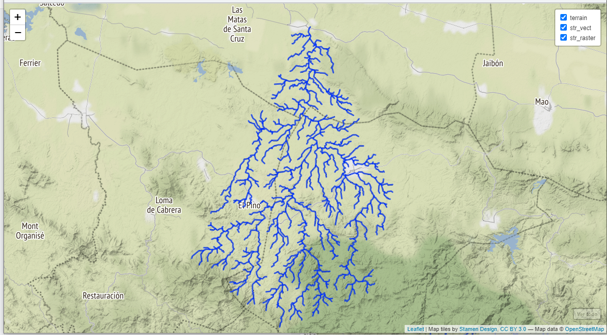{width=70%}

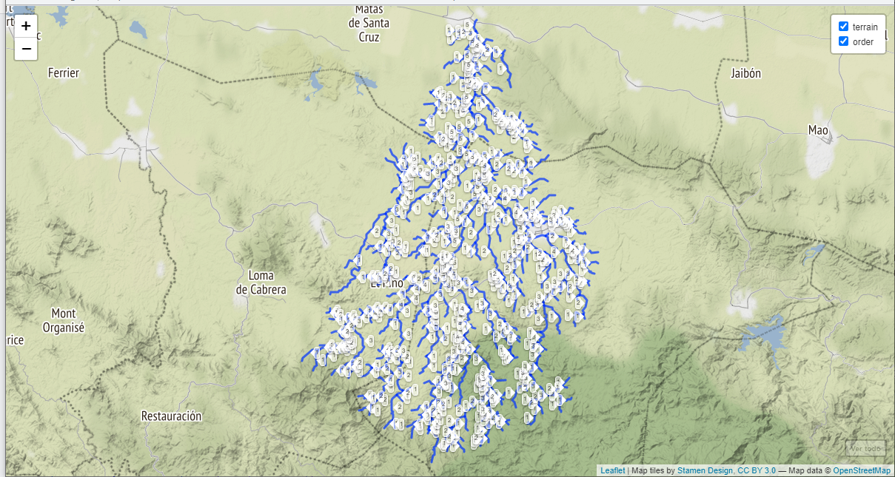{width=100%}

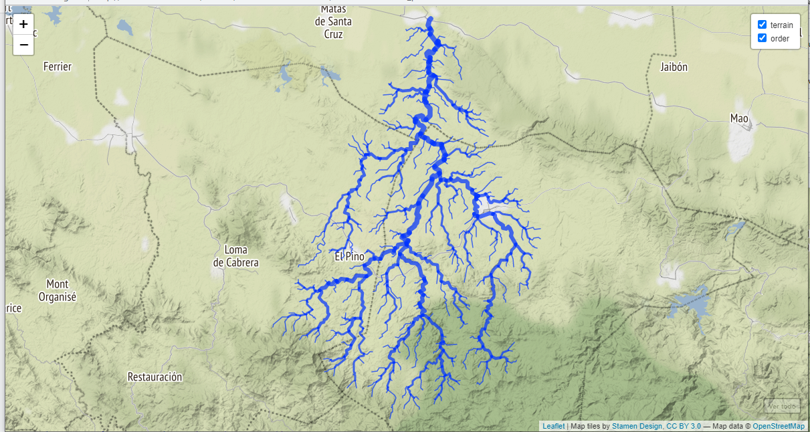{width=80%}

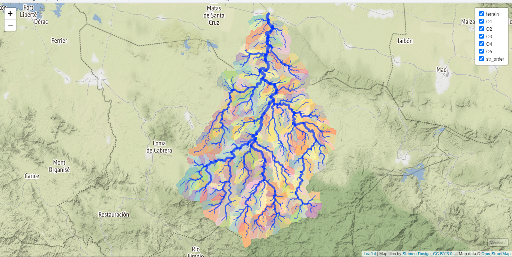{width=70%}

{width=80%}

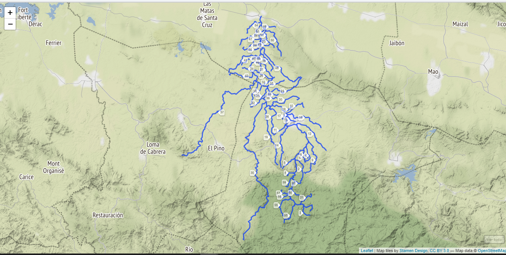{width=100%}

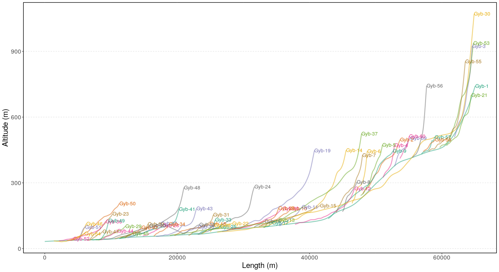{width=100%}

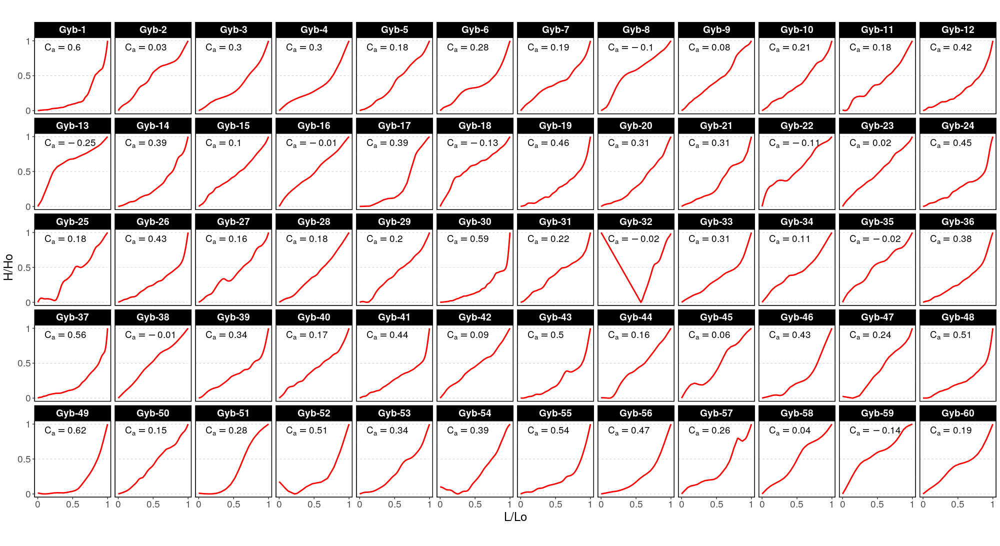{width=100%}

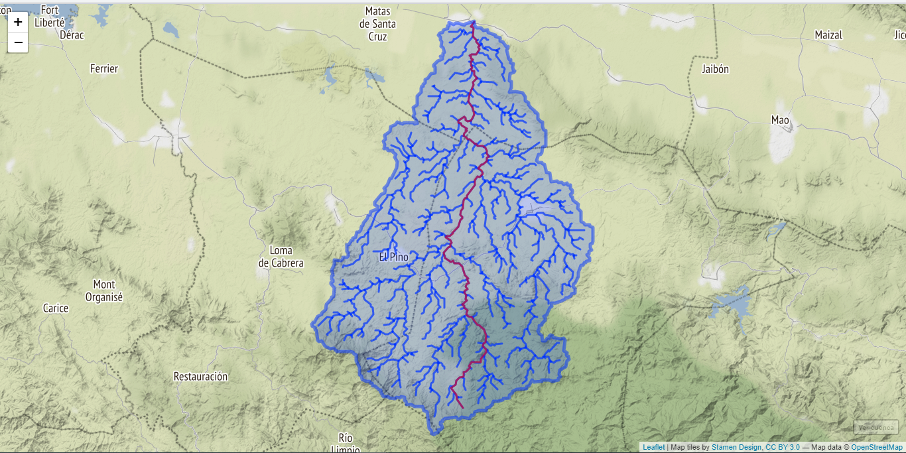{width=60%}

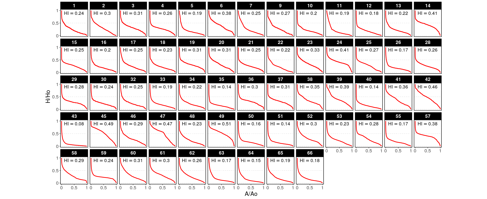{width=110%}

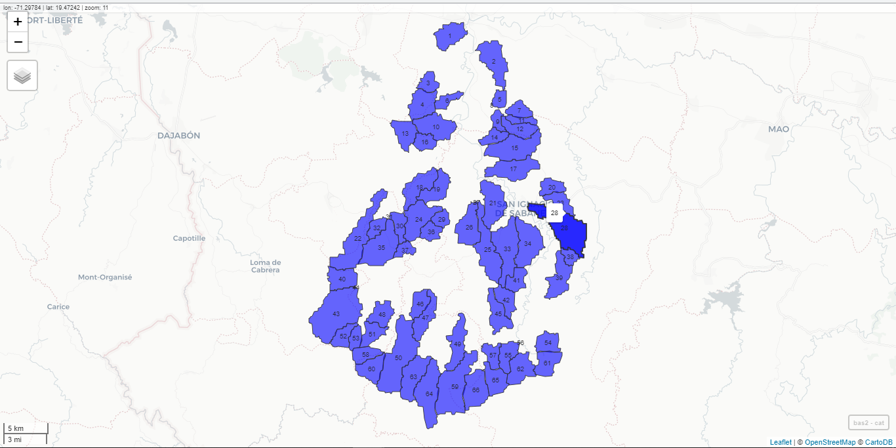{width=90%}

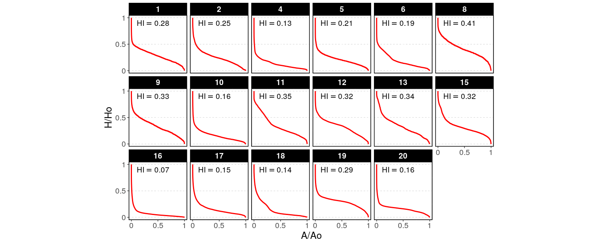{width=100%}

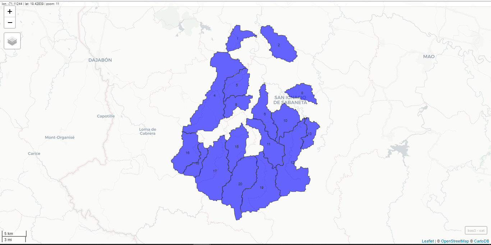{width=90%}


|           Materiales          	|                                                                                                                      Uso                                                                                                                     	|
|:-----------------------------:	|:--------------------------------------------------------------------------------------------------------------------------------------------------------------------------------------------------------------------------------------------:	|
|            RStudio            	| Redacción del manuscrito, procesamiento de datos extraídos del MDE de la cuenca a través de un script.                                                                     	|
|        library rgrass7        	| Creación de interfaz que establecer conexión entre la version 7 del sistema de infromacion geográfica GRASS y R, que crea un entorno GRASS desechable dentro de R.                                                                   	|
|           library sp          	| Importación, manipulación y exportación de datos espaciales en R, e impresión de los mismos.                                                                            	|
|           library sf          	| Creación de caracteristicas simples (simple features), que amplían los objetos tipo data.frame con una columna de lista de características simples.                                                                                                 	|
|         library raster        	| Manipulación de datos geográficos (espaciales) en formato 'ráster'.                                                                                                                               	|
|        library leaflet        	| Representación de los vectores y rásters.                                                                        	|
|         library leafem        	| Proveedor de extensión para leaflet usados para paquetes mapview, permitió mostrar las coordenadas de la posición del puntero del mouse. 	|
|        library mapview        	| Permitió ver los objetos espaciales de forma interactiva.                                                                                                                                                       	|
|         library readr         	| Lector de datos rectangulares (como 'csv', 'tsv' y 'fwf').                                                                                                                  	|
|        QGIS with GRASS        	| Visualizador de vectores y rasters generados con RStudio en una región de GRASS, de los mapas Topográfico y Geológico de la República Dominicana, y, también, Creador de mapas de localización. 	|
|          Google Earth         	| Utilizado para observar datos en formato kml generados y exportados de RStudio y asi como para la representación del relieve del lugar de estudio.                                                                                                          	|
|     Mapa Topográfico de RD     	| Mapa para hacer comparaciones y obtener referencias sobre el relieve.                                                                                                                                                                             	|
| Mapa Geológico Nacional de RD 	| Mapa para hacer comparaciones y obtener referencias sobre la composición rocosa y los años que datan estas (ver figura\ref{magecu}).                                                                                                                                       	|
Table: \label{tab:materiales} Materiales utilizados en la investigacion.


|Max order | Tot.N.str. | Tot.str.len. | Tot.area. | Dr.dens. | Str.freq.|
|:--------:|:----------:|:------------:|:---------:|:--------:|:--------:|
|  (num)   |    (num)   |     (km)     |   (km\textsuperscript{2})   | (km/km\textsuperscript{2}) | (num/km\textsuperscript{2})| 
|    5     |     367    |   693.6069   |  773.2235 |  0.8970  |  0.4746  | 
Table: \label{tab:estadisticaor} Estadísticas de los ordenes de red del río Guayubín


| Bif.rt. | Len.rt. | Area.rt. | Slo.rt. | Grd.rt.|
|:-------:|:-------:|:--------:|:-------:|:------:|
|  4.0643 |  2.2928 |   4.5845 |  1.4798 |  1.8338|
Table: \label{tab:regresionc} Razones de cursos basados en el coeficiente de regresion


| Bif.rt. | Len.rt. | Area.rt. | Slo.rt. | Grd.rt.|
|:-------:|:-------:|:--------:|:-------:|:------:|
|  4.1235 |  2.3822 |   3.3126 |  1.4938 |  1.9010|
|  0.4476 |  0.6025 |   2.2153 |  0.0960 |  0.5050|
Table: \label{tab:estandard} Relaciones de flujo promediadas con desviaciones estándar


|Order num | Avg.len (km) | Avg.ar (km\textsuperscript{2}) | Avg.sl (m/m) | Avg.grad. (m/m) | Avg.el.dif (m) |
|:--------:|:------------:|:------------------------------:|:------------:|:---------------:|:--------------:|
|    1 |  1.2435 |   1.7188 |  0.0367 |     0.0296 | 37.4437|
|    2 |  2.4743 |   7.2904 |  0.0246 |     0.0201 | 49.0820|
|    3 |  6.2881 |  31.7328 |  0.0165 |     0.0113 | 85.1765|
|    4 | 11.5356 | 147.7492 |  0.0120 |     0.0066 | 80.0000|
|    5 | 36.4888 | 773.2235 |  0.0074 |     0.0025 | 91.0000|
Table: \label{tab:promo} Variables promediadas para cada orden de red


|Order num | Std.len (km) |  Std.ar (km\textsuperscript{2}) | Std.sl (m/m) |  Std.grad. (m/m) | Std.el.dif (m) |
|:--------:|:------------:|:-------------------------------:|:------------:|:----------------:|:--------------:|
|    1 |  1.0274 |   1.0955 |  0.0379 |     0.0324 | 52.7742   |
|    2 |  1.9695 |   4.4097 |  0.0215 |     0.0194 | 52.5830   |
|    3 |  5.0992 |  19.0637 |  0.0092 |     0.0077 | 93.4085   |
|    4 |  5.8247 |  44.3177 |  0.0041 |     0.0032 | 57.0789   |
|    5 | -0.0000 |   0.0000 |  0.0000 |     0.0000 |  0.0000   |
Table: \label{tab:estad} Desviacion estandar para las estadisticas segun orden de red


|Order | N.streams | Tot.len (km) | Tot.area (km\textsuperscript{2}) |
|:----:|:---------:|:------------:|:--------------------------------:|
|    1 |       284 |     353.1463 | 488.1383|
|    2 |        61 |     150.9325 | 444.7173|
|    3 |        17 |     106.8969 | 539.4576|
|    4 |         4 |      46.1425 | 590.9969|
|    5 |         1 |      36.4888 | 773.2235|
Table: \label{tab:parh} Estadisticas de parámetros hidrgográficos según el orden de red


|Order | Bif.rt. | Len.rt. | Area.rt. | Slo.rt. | Grd.rt. | d.dens. | str.freq.|
|:----:|:-------:|:-------:|:--------:|:-------:|:-------:|:-------:|:--------:|
|    1 |  4.6557 |  1.9898 |   0.0000 |  1.4930 |  1.4748 |  0.7235 |  0.5818|
|    2 |  3.5882 |  2.5413 |   4.2416 |  1.4930 |  1.7757 |  0.3394 |  0.1372|
|    3 |  4.2500 |  1.8345 |   4.3527 |  1.3771 |  1.7207 |  0.1982 |  0.0315|
|    4 |  4.0000 |  3.1631 |   4.6560 |  1.6122 |  2.6327 |  0.0781 |  0.0068|
|    5 |  0.0000 |  0.0000 |   5.2334 |  0.0000 |  0.0000 |  0.0472 |  0.0013|
Table: \label{tab:razones} Razones de los parámetros hidrográficos según su orden de red


|                           Parámetros                          	|          Valores          	|
|:-------------------------------------------------------------:	|:-------------------------:	|
|                    Easting Centroid of basin                  	|       246465.00       	|
|                   Northing Centroid of basin                  	|       2151675.00      	|
|                 Rectangle containing basin N-W                	| ('230220', '2175930') 	|
|                 Rectangle containing basin S-E                	| ('261000', '2131290') 	|
|                      Area of basin [km\textsuperscript{2}]                     	|      773.5631625      	|
|                     Perimeter of basin [km]                   	|    156.122652506552   	|
|                    Max Elevation [m s.l.m.]                   	|    1396.72540740785   	|
|                    Min Elevation [m s.l.m.]                   	|    30.9651954818271   	|
|                    Elevation Difference [m]                   	|   1365.760211926023   	|
|                         Mean Elevation                        	|        276.7019       	|
|                           Mean Slope                          	|          5.17         	|
|                 Length of Directing Vector [km]               	|   24.460893544594807  	|
|  Prevalent Orientation [degree from north, counterclockwise]  	|   1.4935760627096282  	|
|                     Compactness Coefficient                   	|   4.974655054098116   	|
|                        Circularity Ratio                      	|   0.3988171279899944  	|
|                      Topological Diameter                     	|          84.0         	|
|                        Elongation Ratio                       	|   0.5064682945330589  	|
|                          Shape Factor                         	|   12.483750895456415  	|
|            Concentration Time (Giandotti, 1934) [hr]          	|   6.906840311938352   	|
|                   Length of Mainchannel [km]                  	|      61.965603846     	|
|               Mean slope of mainchannel [percent]             	|   1.9669190473941982  	|
|                    Mean hillslope length [m]                  	|        250.4986       	|
|                            Magnitudo                          	|         223.0         	|
|                      Max order (Strahler)                     	|           5           	|
|                        Number of streams                      	|          343          	|
|                    Total Stream Length [km]                   	|        662.2185       	|
|                  First order stream frequency                 	|   0.2882763952710843  	|
|                   Drainage Density [km/km\textsuperscript{2}]                  	|   0.8560626101427108  	|
|                   Bifurcation Ratio (Horton)                  	|         3.8876        	|
|                      Length Ratio (Horton)                    	|         2.2966        	|
|                       Area ratio (Horton)                     	|         4.3704        	|
|                      Slope ratio (Horton)                     	|         1.4689        	|
Table: \label{tab:parametrosm}Parámetros morfométricos de la cuenca del río Guayubín.


| Categoría 	| Integral hipsométrica 	|
|:---------:	|:---------------------:	|
|     1     	|      0.23784092     	|
|     2     	|      0.29691935     	|
|     3     	|      0.31478851     	|
|     4     	|      0.25845620     	|
|     5     	|      0.18914104     	|
|     6     	|      0.38449116     	|
|     7     	|      0.25087104     	|
|     9     	|      0.26943542     	|
|     10     	|      0.19779399     	|
|     11    	|      0.19287436     	|
|     12    	|      0.17808813     	|
|     13    	|      0.22437828     	|
|     14    	|      0.40595651     	|
|     15    	|      0.25477715     	|
|     16    	|      0.19777159     	|
|     17    	|      0.25313336     	|
|     18    	|      0.22679929     	|
|     19    	|      0.30597060     	|
|     20    	|      0.30564285     	|
|     21    	|      0.24773997     	|
|     22    	|      0.21800099     	|
|     23    	|      0.33229314     	|
|     24    	|      0.40758028     	|
|     25    	|      0.27096759     	|
|     26    	|      0.17485732     	|
|     28    	|      0.25721054     	|
|     29    	|      0.27907973     	|
|     30    	|      0.23545394     	|
|     32    	|      0.24544610     	|
|     33    	|      0.18990261     	|
|     34    	|      0.22303577     	|
|     35    	|      0.14436574     	|
|     36    	|      0.30229714     	|
|     37    	|      0.30742281     	|
|     38    	|      0.34876647     	|
|     39    	|      0.39371293     	|
|     40    	|      0.14419677     	|
|     41    	|      0.36397062     	|
|     42    	|      0.45795809     	|
|     43    	|      0.07642614     	|
|     45    	|      0.48672629     	|
|     46    	|      0.29182502     	|
|     47    	|      0.47300056     	|
|     48    	|      0.22892086     	|
|     49    	|      0.50910119     	|
|     50    	|      0.16011357     	|
|     51    	|      0.14325914     	|
|     52    	|      0.30243670     	|
|     53    	|      0.22622911     	|
|     54    	|      0.27985062     	|
|     55    	|      0.16980308     	|
|     57    	|      0.38363564     	|
|     58    	|      0.29000326     	|
|     59    	|      0.23691203     	|
|     60    	|      0.30564446     	|
|     61    	|      0.30401039     	|
|     62    	|      0.25939942     	|
|     63    	|      0.16711030     	|
|     64    	|      0.14693431     	|
|     65    	|      0.19359746     	|
|     66    	|      0.17854689     	|
Table: \label{tab:ihco2} Integral hipsométrica en las cuencas de orden 2


| Categoría 	| Integral hipsométrico 	|
|:---------:	|:---------------------:	|
|     1     	|       0.28106607      	|
|     2     	|       0.24855493      	|
|     4     	|       0.12697883      	|
|     5     	|       0.21021494      	|
|     6     	|       0.18586633      	|
|     8     	|       0.40849637      	|
|     9     	|       0.33264116      	|
|     10    	|       0.15880640      	|
|     11    	|       0.34507681      	|
|     12    	|       0.32371339      	|
|     13    	|       0.33707592      	|
|     15    	|       0.32319904      	|
|     16    	|       0.06673204      	|
|     17    	|       0.15091492      	|
|     18    	|       0.14111015      	|
|     19    	|       0.29051932      	|
|     20    	|       0.15859746      	|
Table: \label{tab:ihco3} Integral hipsométrica en las cuencas de orden 3


# *Script* reproducible


```{r,eval=F}

# Intro a Grass, video no. 3 ----
## Parte reutilizable del script ----
## Cargar paquetes
library(rgrass7)
library(sp)
use_sp()
library(sf)
library(raster)
library(leaflet)
library(leafem)
library(mapview)
library(readr)

gisdbase <- 'grass-data-test' #Base de datos de GRASS GIS
wd <- getwd() #Directorio de trabajo
wd
loc <- initGRASS(gisBase = "/usr/lib/grass78/",
                 home = wd,
                 gisDbase = paste(wd, gisdbase, sep = '/'),
                 location = 'guayubin',
                 mapset = "PERMANENT",
                 override = TRUE)

## Imprimir fuentes en la region
execGRASS(
  'g.list',
  flags = 't',
  parameters = list(
    type = c('raster', 'vector')
  )
)

## Limpiar archivo de bloqueo del conjunto de mapas de GRASS
unlink_.gislock()

## Fin de la parte reutilizable

# Video no. 4, Definir proyección de la región de GRASS GIS, importar fuente y utilizarla para definir extensión y resolución. Cómo ver la ayuda de las funciones ----
## Muestra la definición de la región
gmeta()

## Definir ruta del DEM
dem <- 'datos-fuente/srtm_dem_cuenca_guayubin.tif'
execGRASS(
  cmd = 'g.proj',
  flags = c('t','c'),
  georef = dem)

## Muestra la definición de la región modificada
gmeta()

## r.in.gdal importa la fuente a GRASS
execGRASS(
  cmd = 'r.in.gdal',
  flags=c('overwrite','quiet'),
  parameters=list(
    input=dem,
    output='dem'
  )
)

## Actualizar la extensión de la región al DEM, sólo por precaución
execGRASS(
  cmd = 'g.region',
  parameters=list(
    raster = 'dem',
    align = 'dem'
  )
)

## Muestra la región de Grass again
gmeta()

## Importar vectorial a la región de Grass
demext <- 'datos-fuente/srtm_dem_cuenca_guayubin.geojson'
execGRASS(
  cmd = 'v.in.ogr',
  flags=c('overwrite','quiet'),
  parameters=list(
    input = demext,
    output = 'dem_extent'
  )
)

## Imprimir lista de mapas ráster y vectoriales dentro en la región/localización activa
execGRASS(
  'g.list',
  flags = 't',
  parameters = list(
    type = c('raster', 'vector')
  )
)

## Ver los addons disponibles en el repositorio oficial de GRASS GIS, incluyendo descripción
execGRASS(
  cmd = 'g.extension',
  flags = 'c'
)

## Consultar la ayuda de una función
parseGRASS("r.in.gdal")

## Consultar la ayuda de una función. Segunda alternativa
system('r.in.gdal --help')

## Limpiar archivo de bloqueo del conjunto de mapas de GRASS
unlink_.gislock()

# Video no. 5, Explorar datos espaciales básicos entre GRASS y R ----
## Imprimir lista de mapas ráster y vectoriales dentro en la región/localización activa
execGRASS(
  'g.list',
  flags = 't',
  parameters = list(
    type = c('raster', 'vector')
  )
)

## Cargar en R el DEM (mapa ráster)
library(sp)
use_sp()
dem_sp <- readRAST('dem')
op <- par()
plot(dem_sp)

## Cargar a R el mapa vectorial de una cuenca que se encuentra alojado fuera de GRASS, hacer el plot y representar la cuenca del rio Guayubin superpuesta
library(sf)
rutaguayubin <- 'datos-fuente/cuenca_guayubin.geojson'
guayubin <- st_read(rutaguayubin)
plot(dem_sp)
plot(guayubin, add=T, col='transparent', border='black', lwd=5);par(op[c('mfrow','mar')])

## Analizar el DEM dentro de la cuenca de guayubin
library(raster)
dem_r0 <- raster(dem_sp)
dem_r1 <- crop(dem_r0, guayubin)
dem_guayu <- mask(dem_r1, guayubin)
plot(dem_guayu)
summary(dem_guayu)
hist(dem_guayu)

## Obtener variables de terreno básicas con el paquete raster dentro de R
pend_guayu <- terrain(x = dem_guayu, opt = 'slope', unit = 'degrees')
plot(pend_guayu)
summary(pend_guayu)
hist(pend_guayu)

## Obtener la misma variable de terreno con GRASS GIS
writeVECT(as_Spatial(guayubin), 'guayubin', v.in.ogr_flags='quiet')
execGRASS(
  "g.region",
  parameters=list(
    vector = "guayubin"
  )
)

execGRASS(
  "r.mask",
  flags = c('verbose','overwrite','quiet'),
  parameters = list(
    vector = 'guayubin'
  )
)

execGRASS(
  cmd = 'r.slope.aspect',
  flags = c('overwrite','quiet'),
  parameters = list(
    elevation='dem',
    slope='slope',
    aspect='aspect',
    pcurvature='pcurv',
    tcurvature='tcurv')
)

pend_guayu_g <- readRAST('slope')
plot(pend_guayu_g);par(op[c('mfrow','mar')])
summary(pend_guayu_g)
summary(pend_guayu)
gmeta()

execGRASS(
  "g.region",
  parameters=list(
    raster = "dem"
  )
)

execGRASS(
  "r.mask",
  flags = c('r','quiet')
)

gmeta()

## Limpiar archivo de bloqueo del conjunto de mapas de GRASS
unlink_.gislock()

# Video 6. Calcular parámetros hidrográficos con r.watershed. Visualizar con leaflet ----

## Imprimir lista de mapas ráster y vectoriales dentro en la región/localización activa 
## Está en el archivo reusable como (# Imprimir fuentes en la region)
execGRASS(
  'g.list',
  flags = 't',
  parameters = list(
    type = c('raster', 'vector')
  )
)
## Calcular parámetros hidrográficos de interés usando r.watershed
execGRASS(
  "r.watershed",
  flags = c('overwrite','quiet'),
  parameters = list(
    elevation = "dem",
    accumulation = "accum-de-rwshed",
    stream = "stream-de-rwshed",
    drainage = "drainage-dir-de-rwshed",
    basin = 'basins',
    half_basin = 'half-basins',
    threshold = 80
  )
)

## Traer capas a R

## Usar Spatial*
library(sp)
use_sp()
## Paquete manejo de los raster
library(raster)
## DEM
dem <- raster(readRAST('dem'))
## Basins
basins <- raster(readRAST('basins'))
## Stream network
stream <- raster(readRAST('stream-de-rwshed'))
stream3857 <- projectRaster(stream, crs = CRS("+init=epsg:3857"), method = 'ngb')
## Generar un vectorial de extensión de capa en EPSG:4326
e <- extent(stream)
e <- as(e, 'SpatialPolygons')
proj4string(e) <- CRS("+init=epsg:32619")
e <- spTransform(e, CRSobj = CRS("+init=epsg:4326"))

## Visualizar capas con leaflet
library(leaflet)
library(leafem)
leaflet() %>%
  addProviderTiles(providers$Stamen.Terrain, group = 'terrain') %>%
  addRasterImage(dem, group='DEM', opacity = 0.5) %>%
  addRasterImage(
    ratify(basins),
    group='basins', opacity = 0.7,
    colors = sample(rep(RColorBrewer::brewer.pal(12, 'Set3'),1000))) %>% 
  addRasterImage(stream3857, project = F, group='str', opacity = 0.7, method = 'ngb', colors = 'blue') %>% 
  addLayersControl(
    overlayGroups = c('terrain','DEM','basins','str'),
    options = layersControlOptions(collapsed=FALSE)) %>% 
  addHomeButton(extent(e), 'Ver todo')

## Limpiar archivo de bloqueo del conjunto de mapas de GRASS
unlink_.gislock()

# Video 7, Extraer una cuenca con r.water.outlet. Visualizar con mapview y leaflet ----
## Imprimir lista de mapas ráster y vectoriales dentro en la región/localización activa (está en el reproducible)
execGRASS(
  'g.list',
  flags = 't',
  parameters = list(
    type = c('raster', 'vector')
  )
)

## Obtener las coordenadas de la desembocadura de la cuenca de interés
library(mapview)
mapview(
  stream3857, method='ngb', col.regions = 'blue',
  legend = FALSE, label = FALSE, maxpixels =  910425
)

## Convertir las coordenadas lat/lon a EPSG:32619
my_trans <- function(coords = NULL) {
  require(sp)
  pt <- SpatialPoints(matrix(coords, ncol = 2), CRS("+init=epsg:4326"))
  foo <- spTransform(pt, CRSobj = CRS("+init=epsg:32619"))
  bar <- as.vector(coordinates(foo))
  return(bar)
}
guayu_out <- my_trans(coords = c(-71.40021,19.66387))
guayu_out

## Extraer la cuenca de interés
execGRASS(
  "r.water.outlet",
  flags = c('overwrite','quiet'),
  parameters = list(
    input = 'drainage-dir-de-rwshed',
    output = 'guayubin-basin',
    coordinates = guayu_out
  )
)

## Convertir la cuenca a vectorial en GRASS
execGRASS(
  "r.to.vect",
  flags = c('overwrite','quiet'),
  parameters = list(
    input = 'guayubin-basin',
    output = 'guayubin_basin',
    type = 'area'
  )
)

## Mostrar lista nuevamente
execGRASS(
  'g.list',
  flags = 't',
  parameters = list(
    type = c('raster', 'vector')
  )
)

## Traer a R la cuenca del rio guayubin
guayu_bas <- readVECT('guayubin_basin')
guayu_bas
plot(guayu_bas)
guayu_bas4326 <- spTransform(guayu_bas, CRSobj = CRS("+init=epsg:4326"))
leaflet() %>% 
  addProviderTiles(providers$Stamen.Terrain) %>%
  addRasterImage(stream, opacity = 0.7, method = 'ngb', colors = 'blue') %>% 
  addPolygons(data = guayu_bas4326) %>% 
  leafem::addHomeButton(extent(guayu_bas4326), 'Ver cuenca')

## Limpiar archivo de bloqueo del conjunto de mapas de GRASS
unlink_.gislock()
```


```{r, eval=F}
# Video 8, Extraer una red drenaje con r.stream.extract. Visualizar con leaflet ----
## Imprimir lista de mapas ráster y vectoriales dentro en la región/localización activa
execGRASS(
  'g.list',
  flags = 't',
  parameters = list(
    type = c('raster', 'vector')
  )
)

## Usar la cuenca del rio guayubin como máscara
execGRASS(
  "r.mask",
  flags = c('verbose','overwrite','quiet'),
  parameters = list(
    vector = 'guayubin_basin'
  )
)

## Extraer la red de drenaje de la cuenca de interés
execGRASS(
  "r.stream.extract",
  flags = c('overwrite','quiet'),
  parameters = list(
    elevation = 'dem',
    threshold = 80,
    stream_raster = 'guayubin-stream-de-rstr',
    stream_vector = 'guayubin_stream_de_rstr'
  )
)

## Mostrar lista nuevamente
execGRASS(
  'g.list',
  flags = 't',
  parameters = list(
    type = c('raster', 'vector')
  )
)

## Traer a R la red de drenaje del rio guayubin
guayu_net <- readVECT('guayubin_stream_de_rstr', ignore.stderr = T)
guayu_net
plot(guayu_net)
guayu_net4326 <- spTransform(guayu_net, CRSobj = CRS("+init=epsg:4326"))
guayu_net4326
guayu_centroid <- coordinates(rgeos::gCentroid(guayu_bas4326))
guayu_centroid
guayu_net_r <- raster(readRAST('guayubin-stream-de-rstr'))
guayu_net_r
guayu_net_r3857 <- projectRaster(guayu_net_r, crs = CRS("+init=epsg:3857"), method = 'ngb')
guayu_net_r3857
leaflet() %>% 
  setView(lng = guayu_centroid[1], lat = guayu_centroid[2], zoom = 11) %>%
  addProviderTiles(providers$Stamen.Terrain, group = 'terrain') %>%
  addRasterImage(guayu_net_r3857, opacity = 0.7, method = 'ngb', colors = 'grey20', group = 'str_raster') %>% 
  addPolylines(data = guayu_net4326, weight = 3, opacity = 0.7, group = 'str_vect') %>% 
  leafem::addHomeButton(extent(guayu_net4326), 'Ver todo') %>% 
  addLayersControl(
    overlayGroups = c('terrain','str_vect','str_raster'),
    options = layersControlOptions(collapsed=FALSE)) 

## Limpiar archivo de bloqueo del conjunto de mapas de GRASS
unlink_.gislock()


# Video 10,  Orden de red y análisis hortoniano usando r.stream*. Visualizar con leaflet ----
## Imprimir lista de mapas ráster y vectoriales dentro en la región/localización activa (está en el reproducible)
execGRASS(
  'g.list',
  flags = 't',
  parameters = list(
    type = c('raster', 'vector')
  )
)

## Crear mapa de dirección de flujo a partir de r.stream.extract
execGRASS(
  "r.stream.extract",
  flags = c('overwrite','quiet'),
  parameters = list(
    elevation = 'dem',
    threshold = 80,
    direction = 'drainage-dir-de-rstr'
  )
)

## Crear mapas de órdenes de red
execGRASS(
  "r.stream.order",
  flags = c('overwrite','quiet'),
  parameters = list(
    stream_rast = 'guayubin-stream-de-rstr',
    direction = 'drainage-dir-de-rstr',
    elevation = 'dem',
    accumulation = 'accum-de-rwshed',
    stream_vect = 'order_all',
    strahler = 'order-strahler',
    horton = 'order-horton',
    shreve = 'order-shreve',
    hack = 'order-hack-gravelius',
    topo = 'order-topology'
  )
)

## Visualizar la red con leaflet
## Simbología única
order <- readVECT('order_all')
order4326 <- spTransform(order, CRSobj = CRS("+init=epsg:4326"))
leaflet() %>% 
  addProviderTiles(providers$Stamen.Terrain, group = 'terrain') %>%
  addPolylines(
    data = order4326, weight = 3, opacity = 0.7, group = 'order',
    label = ~as.character(strahler),
    highlightOptions = highlightOptions(color = "white",
                                        weight = 5, bringToFront = F, opacity = 1),
    labelOptions = labelOptions(noHide = T,
                                style = list(
                                  "font-size" = "8px",
                                  "background" = "rgba(255, 255, 255, 0.5)",
                                  "background-clip" = "padding-box",
                                  "padding" = "1px"))) %>% 
  leafem::addHomeButton(extent(order4326), 'Ver todo') %>% 
  addLayersControl(
    overlayGroups = c('terrain','order'),
    options = layersControlOptions(collapsed=FALSE))

## Simbología aplicando grosor según orden de red
leaflet() %>% 
  addProviderTiles(providers$Stamen.Terrain, group = 'terrain') %>%
  addPolylines(
    data = order4326, weight = order4326$strahler*1.5, opacity = 0.7, group = 'order',
    label = ~as.character(strahler),
    highlightOptions = highlightOptions(color = "white",
                                        weight = 5, bringToFront = F, opacity = 1),
    labelOptions = labelOptions(noHide = F)) %>% 
  leafem::addHomeButton(extent(order4326), 'Ver todo') %>% 
  addLayersControl(
    overlayGroups = c('terrain','order'),
    options = layersControlOptions(collapsed=FALSE))

## Delimitar cuencas según orden de red de Strahler

## Obtener órdenes de red mínimo y máximo
## Estadísticas para obtener los valores mínimo y máximo del orden de red de Strahler
rinfo.ordstra <- execGRASS(
  'r.info',
  flags = 'r',
  parameters = list(
    map = 'order-strahler'
  )
)

## Órdenes de red mínimo y máximo
minmaxord <- as.numeric(
  stringr::str_extract_all(
    attributes(rinfo.ordstra)$resOut,
    "[0-9]+"
  )
)
minmaxord

## Delimitar cuencas, convertirlas de ráster a vectorial
sapply(
  min(minmaxord):max(minmaxord),
  function(x){
    execGRASS(
      "r.stream.basins",
      flags = c('overwrite','c','quiet'),
      parameters = list(
        direction = 'drainage-dir-de-rstr',
        stream_rast = 'order-strahler',
        cats = as.character(x),
        basins = paste0('r-stream-basins-',x)
      )
    )
    execGRASS(
      "r.to.vect",
      flags=c('overwrite','quiet'),
      parameters = list(
        input = paste0('r-stream-basins-',x),
        output = paste0('r_stream_basins_',x),
        type = 'area'
      )
    )
  }

)
## Representar las cuencas con leaflet
sapply(
  min(minmaxord):max(minmaxord),
  function(x){
    assign(
      paste0('orden', x),
      spTransform(readVECT(paste0('r_stream_basins_',x)), CRSobj = CRS("+init=epsg:4326")),
      envir = .GlobalEnv)
  }
)

paleta <- RColorBrewer::brewer.pal(12, 'Set3')
leaflet() %>% 
  addProviderTiles(providers$Stamen.Terrain, group = 'terrain') %>%
  addPolygons(data = orden5, stroke = T, weight = 2,
              color = ~paleta, fillOpacity = 0.4, group = 'O5') %>% 
   addPolygons(data = orden4, stroke = T, weight = 2,
              color = ~paleta, fillOpacity = 0.4, group = 'O4') %>% 
  addPolygons(data = orden3, stroke = T, weight = 2,
              color = ~paleta, fillOpacity = 0.4, group = 'O3') %>%
  addPolygons(data = orden2, stroke = T, weight = 2,
              color = ~paleta, fillOpacity = 0.4, group = 'O2') %>%
  addPolygons(data = orden1, stroke = T, weight = 2,
              color = ~paleta, fillOpacity = 0.4, group = 'O1') %>%
  addPolylines(
    data = order4326, weight = order4326$strahler*1.5,
    opacity = 0.7, group = 'str_order') %>%
  leafem::addHomeButton(extent(order4326), 'Ver todo') %>% 
  addLayersControl(
    overlayGroups = c('terrain','O1','O2','O3','O4','O5','str_order'),
    options = layersControlOptions(collapsed=FALSE))

## Estadísticas de red resumidas por orden de red
execGRASS(
  "r.stream.stats",
  flags = c('overwrite','quiet','o'),
  parameters = list(
    stream_rast = 'order-strahler',
    direction = 'drainage-dir-de-rstr',
    elevation = 'dem',
    output = 'guayu_stats.txt'
  )
)
file.show('guayu_stats.txt')
d <- read.csv("guayu_stats.txt", skip=1, header=TRUE)
plot(num_of_streams~order, data=d, log="y")
mod <- lm(log10(num_of_streams)~order, data=d)
abline(mod)
text(2, 20, 'logN=2.064-0.544u')
rb <- 1/10^mod$coefficients[[2]]
rb

## Estadísticas de red ampliadas
execGRASS(
  "r.stream.stats",
  flags = c('overwrite','quiet'),
  parameters = list(
    stream_rast = 'order-strahler',
    direction = 'drainage-dir-de-rstr',
    elevation = 'dem',
    output = 'guayu_stats_expanded.txt'
  )
)
file.show('guayu_stats_expanded.txt')

## Limpiar archivo de bloqueo del conjunto de mapas de GRASS
unlink_.gislock()
```


```{r, eval=F}
# Video 11, Calcular índices de concavidad y perfiles longitudinales de cursos fluviales----
## Imprimir lista de mapas ráster y vectoriales dentro en la región/localización activa
execGRASS(
  'g.list',
  flags = 't',
  parameters = list(
    type = c('raster', 'vector')
  )
)

## Obtener coordenada
mapview(order, col.regions = 'blue', legend = FALSE)

## Obtener cursos más largos (cargar función propia)
devtools::source_url('https://raw.githubusercontent.com/geofis/rgrass/master/lfp_network.R') #Cargada como función "LfpNetwork"
LfpNetwork(
  xycoords = my_trans(c(-71.40047,19.66268)),
  suffix = 'Gyb',
  stream_vect = 'order_all',
  direction = 'drainage-dir-de-rstr'
)

## Imprimir lista de mapas ráster y vectoriales
execGRASS(
  'g.list',
  flags = 't',
  parameters = list(
    type = c('raster', 'vector')
  )
)

## Representar con leaflet
lfp <- readVECT('LfpNetwork_lfp_all_final_Gyb')
lfp4326 <- spTransform(lfp, CRSobj = CRS("+init=epsg:4326"))
leaflet() %>%
  addProviderTiles(providers$Stamen.Terrain, group = 'terrain') %>%
  addPolylines(
    data = lfp4326, weight = 3, opacity = 0.7, group = 'order',
    label = ~as.character(cat),
    highlightOptions = highlightOptions(color = "white",
                                        weight = 5, bringToFront = F, opacity = 1),
    labelOptions = labelOptions(noHide = T,
                                style = list(
                                  "font-size" = "8px",
                                  "background" = "rgba(255, 255, 255, 0.5)",
                                  "background-clip" = "padding-box",
                                  "padding" = "1px"))) %>% 
  leafem::addHomeButton(extent(lfp4326), 'Ver todo')

## Exportar a KML
execGRASS(
  'v.out.ogr',
  flags = c('overwrite','quiet'),
  parameters = list(
    input = 'LfpNetwork_lfp_all_final_Gyb',
    output = 'lfp_kml.kml',
    format = 'KML',
    dsco = 'NameField=cat'
  )
)

## Obtención de perfiles longitudinales e índices de concavidad
source('lfp_profiles_concavity.R') #Cargado como función "LfpProfilesConcavity"
guayubin_conv_prof <- LfpProfilesConcavity(
  xycoords = my_trans(c(-71.40047,19.6626)),
  network = 'LfpNetwork_lfp_all_final_Gyb',
  prefix = 'Gyb',
  dem = 'dem',
  direction = 'drainage-dir-de-rstr',
  crs = '+init=epsg:32619',
  smns = 0.5,
  nrow = 5)

## Mostrar resultados
guayubin_conv_prof$profiles
guayubin_conv_prof$concavityindex
guayubin_conv_prof$dimensionlessprofiles

## Tabla dx/dy, tanto en metros como adimensional. Útiles para construir perfiles por cuenta propia
guayubin_conv_prof$lengthzdata %>% tibble::as.tibble()
guayubin_conv_prof$lengthzdatadmnls %>% tibble::as.tibble()

## Revisar en QGIS/Google Earth relación litología/concavidad
## Descargar archivo lfp_kml.kml localmente, superponer al mapa geológico usando QGIS y GoogleEarth, evaluar los índices de concavidad y formas del perfil longitudinal de los cursos más largos en relación con la litología, las fallas, el orden de red, entre otras variables.

## Limpiar archivo de bloqueo del conjunto de mapas de GRASS
unlink_.gislock()

# Video 12, Parámetros de cuenca con r.basin ----
library(rgrass7)
gisdbase <- 'grass-data-test' #Base de datos de GRASS GIS
wd <- getwd() #Directorio de trabajo
wd
loc <- initGRASS(gisBase = "/usr/lib/grass78/",
                 home = wd,
                 gisDbase = paste(wd, gisdbase, sep = '/'),
                 location = 'guayubin',
                 mapset = "PERMANENT",
                 override = TRUE)
gmeta()
execGRASS(
  'g.list',
  flags = 't',
  parameters = list(
    type = c('raster', 'vector')
  )
)

## Convertir a números enteros la extensión y la resolución del DEM
library(raster)
rutadem <- 'datos-fuente/srtm_dem_cuenca_guayubin.tif'
rawextent <- extent(raster(rutadem))
rawextent
devtools::source_url('https://raw.githubusercontent.com/geofis/rgrass/master/integerextent.R')
devtools::source_url('https://raw.githubusercontent.com/geofis/rgrass/master/xyvector.R')
newextent <- intext(e = rawextent, r = 90, type = 'inner')
newextent
gdalUtils::gdalwarp(
  srcfile = 'datos-fuente/srtm_dem_cuenca_guayubin.tif',
  dstfile = 'demint.tif',
  te = xyvector(newextent),
  tr = c(90,90),
  r = 'bilinear',
  overwrite = T
)

## Importar a sesión de GRASS
rutademint <- 'demint.tif'
execGRASS(
  "g.proj",
  flags = c('t','c'),
  georef=rutademint)
gmeta()
execGRASS(
  "r.in.gdal",
  flags='overwrite',
  parameters=list(
    input=rutademint,
    output="demint"
  )
)

execGRASS(
  "g.region",
  parameters=list(
    raster = "demint",
    align = "demint"
  )
)

gmeta()

execGRASS(
  'g.list',
  flags = 't',
  parameters = list(
    type = c('raster', 'vector')
  )
)

## Generar red de drenaje para obtener coordenada posteriormente
execGRASS(
  "r.stream.extract",
  flags = c('overwrite','quiet'),
  parameters = list(
    elevation = 'demint',
    threshold = 80,
    stream_raster = 'stream-de-rstr',
    stream_vector = 'stream_de_rstr'
  )
)

execGRASS(
  'g.list',
  flags = 't',
  parameters = list(
    type = c('raster', 'vector')
  )
)

## Obtener coordenada
library(sp)
use_sp()
library(mapview)
netw <- spTransform(
  readVECT('stream_de_rstr'),
  CRSobj = CRS("+init=epsg:4326"))

mapview(netw, col.regions = 'blue', legend = FALSE)

## Transformar coordenada a EPSG:32619 como número entero
source('my-trans.R')
outlet <- as.integer(my_trans(c(-71.40009,19.66390)))

## Ejecutar r.basin
pref <- 'rbasin_guay'
execGRASS(
  "r.basin",
  flags = 'overwrite',
  parameters = list(
    map = 'demint',
    prefix = pref,
    coordinates = outlet,
    threshold = 80,
    dir = 'salidas-rbasin/guayubin'
  )
)

execGRASS(
  'g.list',
  flags = 't',
  parameters = list(
    type = c('raster', 'vector')
  )
)

# Si r.basin arrojara error (sólo en el caso de error, no en caso de advertencia), ejecutar este bloque para borrar las salidas anteriores y reejecutar el r.basin:
#  execGRASS(
#    "g.remove",
#    flags = 'f',
#    parameters = list(
#      type = c('raster','vector'),
#      pattern = paste0(pref, '*')
#    )
#  )

## Cargar los vectoriales transformados a EPSG:4326 para visualizar en leaflet
  rbnetw <- spTransform(
    readVECT('rbasin_guay_demint_network'),
    CRSobj = CRS("+init=epsg:4326"))
  rbnetw
  rbmain <- spTransform(
    readVECT('rbasin_guay_demint_mainchannel'),
    CRSobj = CRS("+init=epsg:4326"))
  rbmain
  rbbasin <- spTransform(
    readVECT('rbasin_guay_demint_basin'),
    CRSobj = CRS("+init=epsg:4326"))
  rbbasin
 
library(leaflet)
leaflet() %>%
    addProviderTiles(providers$Stamen.Terrain, group = 'terrain') %>%
    addPolylines(data = rbnetw, weight = 3, opacity = 0.7) %>% 
    addPolylines(data = rbmain, weight = 3, opacity = 0.7, color = 'red') %>% 
    addPolygons(data = rbbasin) %>% 
    leafem::addHomeButton(extent(rbbasin), 'Ver cuenca')
  
## Explorar los parámetros de cuenca
library(readr)
rbguaypar1 <- read_csv("salidas-rbasin/guayubin/rbasin_guay_demint_parametersT.csv")
rbguaypar1 %>% tibble::as_tibble()
# para vizualizar la tabla mejor traer a r, usar View(rbguaypar1)

rbguaypar2 <- read_csv(
  "salidas-rbasin/guayubin/rbasin_guay_demint_parameters.csv",
  skip=2, col_names = c('Parameter', 'Value'))
rbguaypar2 %>% print(n=Inf)

## Limpiar archivo de bloqueo del conjunto de mapas de GRASS
unlink_.gislock()

# Video 13, Curva e integral hipsométrica ----
## Imprimir lista de mapas ráster y vectoriales dentro en la región/localización activa
execGRASS(
  'g.list',
  flags = 't',
  parameters = list(
    type = c('raster', 'vector')
  )
)

## Representar cuencas
library(sp)
use_sp()
library(mapview)
bas2 <- readVECT('r_stream_basins_2')
bas3 <- readVECT('r_stream_basins_3')

## Curva e integral hipsométrica
source('integral_hypsometric_curve.R') #Cargada como función "HypsoIntCurve"
HypsoBasinsOrder2 <- HypsoIntCurve(
  basins = 'r_stream_basins_2',
  dem = 'dem',
  labelfield = 'cat',
  nrow = 5,
  labelsize = 4
)

HypsoBasinsOrder2$HypsoInt
HypsoBasinsOrder2$HypsoCurve
mapview(bas2, zcol='cat', col.regions = 'blue', legend = FALSE) %>%
  addStaticLabels(label = bas2$cat)

HypsoBasinsOrder3 <- HypsoIntCurve(
  basins = 'r_stream_basins_3',
  dem = 'dem',
  labelfield = 'cat',
  nrow = 3,
  labelsize = 4
)

HypsoBasinsOrder3$HypsoInt
HypsoBasinsOrder3$HypsoCurve

mapview(bas3, zcol='cat', col.regions = 'blue', legend = FALSE) %>%
  addStaticLabels(label = bas3$cat)

## Limpiar archivo de bloqueo del conjunto de mapas de GRASS
unlink_.gislock()
```

# Referencias