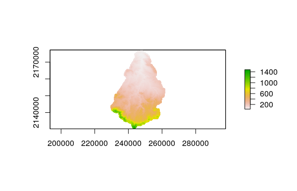

# Introducción

La geomorfología como ciencia estudia las diferentes formas que constituyen el relieve; estas formas muestran las distintas características espaciales de una extensión, poniendo de manifiesto la desigualdad en la estructura de lo que conoce como paisaje.
Así como la forma del relieve es el objeto de estudio de la Geomorfología, se entiende que estas formas se producen por el efecto de una serie o series de acciones sucesivas y regulares (@christofoletti1988geomorfologia). 

Por lo que la Geomorfología es considerada la ciencia que estudia los procesos que intervienen en la formación del relieve.
En geomorfología es posible distinguir la que estudia el relieve o geomorfología estructural, y la que geomorfología que tiene su interés en la forma del terreno considerando la acción erosiva o geomorfología climática (@arroyo2012esbozo). 

Según @gutierrez2008geomorfologia, la geomorfología además de ser descriptiva debe ser cuantitativa, y así dejar la dependencia de métodos pertenecientes a otros campos científicos, como lo hace con la Física.
La geomorgfologia posee varias ramas: Geomorfologia climática, Geomorfología eólica, Geomorfología glaciar, Geomorfología estructural y Geomorfología fluvial, esta última es en la que se basa la investigación.

La geomorfología fluvial, según Christofoletti (citado por, @morais2010geomorfologia), tiene una inclinación por el análisis de los distintos procesos y formas interconectadas con el drenaje de los ríos. Para él investigar las escorrentías fluviales, son cruciales en geomorfología y en el estudio de las distintas redes hidrográficas, al momento de entender los cauntiosos problemas geomorfológicos, debido a que las vías fluviales forman los procesos morfogenéticos entre los más activos al momento de esculpir el paisaje terrestre.

Para Richards (como citó @gutierrez2008geomorfologia), describe la conexión existente entre los distintos procesos de circulación de los conductos del cauce, el movimiento y equilibrio de la conduccion de sedimentos empujados por el flujo y el modelado de los conductos aluviales productos del traslado de sedimentos. 

@morais2010geomorfologia, afirman que para poder estudiar y comprender las propiedades de una cuenca hidrográfica es necesario el análisis morfométrico,considerandolo como una herramienta necesaria, debido a que con este es posible mensurar la configuración del relieve. 

La morfometría fluvial 

# Metodología

2.1 Área de estudio
La cuenca del río Guayubín, abarca  

# Resultados

\ldots

# Discusión

\ldots

# Agradecimientos

\ldots

# Información de soporte

\ldots

# *Script* reproducible

\ldots

# Referencias
