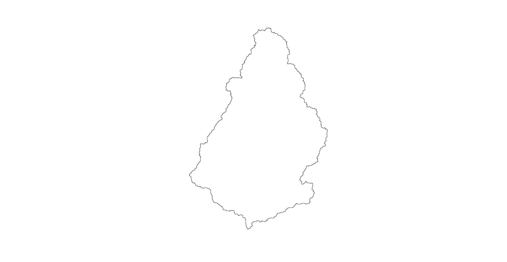

# Introducción
Desde hace siglos atrás el hombre ha buscado la manera de explicar y entender las distintas formas que el paisaje terrestre (relieve) posee. Autores numerosos han investigado la génesis de estas nociones geomorfológicas, remontándose a tres siglos atrás. Autores como Hutton, Playfair y Lyell, sirvieron de antecesores o bases para la ciencia geomorfológica. Tras su consolidación como ciencia en Francia numerosos autores fueron demostrando la importancia de esta ciencia, incluso ramificándola (climática, eólica, litoral, glaciar, estructural, tectónica, kárstica y fluvial; siendo la última de interés para esta investigación), para mayor eficacia en sus estudios.

Los estudios en la geomorfología fluvial a nivel mundial son numerosos y han servido para explicar cómo los drenajes de los ríos y sus redes hidrográficas son importantes para la geomorfología, ya que estas redes fluviales son parte de los procesos de modelado más activos en la formación del relieve y que permiten mensurar la configuración del mismo.
Para los estudios en geomorfología fluvial, se hace uso del análisis morfométrico de cuencas hidrográficas. La morfometría de cuenca se ha convertido en la técnica cuantitativa para el estudio de las cuencas de manera detallada y ordenada. Actualmente en la República Dominicana el uso del análisis morfométrico para estudiar cuencas hidrográficas es poco e insuficiente, a pesar de que la República Dominicana goza de una diversa y extensa red de cuencas hidrográficas, ricas y aprovechables para la aplicación de diversas técnicas con el fin de explicar y entender las propiedades del relieve y su relación con las cuencas fluviales. Por lo que, este estudio es un aporte para dar a conocer la configuración y modelado de la cuenca hidrográfica del rio Guayubín, con el fin de fijar parámetros que permitan evaluar esta cuenca fluvial; identificando el aspecto general de la cuenca y de la red, el orden de red y análisis hortoniano, los perfiles longitudinales e índice de concavidad de cursos más largos, y la morfometría de cuenca.
En ese mismo orden es imprescindible conocer el concepto de cuenca fluvial o de drenaje, que no es más que el conjunto de cuerpos de agua con un área determinada que fluyen por distintos canales y escurren en un mismo desagüe. Según los autores Gregory y Walling, 1973; y Chorley, 1969 (como citó @gutierrez2008geomorfologia), una cuenca fluvial compone el espacio determinado en el que se suministran las aguas que discurren por la superficie, el mismo está delimitado tanto por su relieve y su hidrología. También considerada como una unidad imprescindible en geomorfológica.

## Revisión bibliográfica 
Aspecto general de la cuenca y de la red

El aspecto general de la cuenca y de la red se refiere a los parámetros hidrográficos que posee la cuenca (la acumulación de flujos y cálculo de su umbral, elevación, depresión, y otros). Según @castillo2015delimitacion, la acumulación de flujos señala a todas las celdas que desaguan en una en particular, la misma se adquiere partiendo de la dirección de la corriente o flujo. @venkatachalam2001automatic dicen que la acumulación de flujo de una celda se instituye de acuerdo con la sumatoria de los valores de la acumulación de flujo de las celdas próximas que drenan en ella. En cuanto al umbral, según @ESRI2012, se es necesario un ráster de acumulación de flujo y la `porción mínima de celdas que componen una corriente de agua. También se refiere a la forma que adquiere la cuenca y a la forma de su red de drenaje, según la conformación de sus ríos y el material rocoso que la compone (patrones de drenaje). Varios autores expresan que existe una conexión entre la estructura que posee la red de drenaje con el material rocoso (@pedraza1996geomorfologia, @gutierrez2008geomorfologia, @howard1967drainage, @gregory1973drainage). 

Orden de red y análisis hortoniano

El orden de red hace referencia al orden en el que se clasifican los cursos de agua, todo en base a su ramificación. Según @wikipedia2020stream, el orden de un curso de agua es siempre un número entero positivo que se usa tanto en Geomorfología como en Hidrología para denotar la magnitud de ramificación que posee una red fluvial.
Para @bowden1964effect, el orden de red sostiene una relación entre las rocas con la configuración de la red fluvial y con los procesos tanto hidrológicos como erosivos.
La clasificación de la red se hace de manera jerárquica. Hoy día existen múltiples normas para determinar la jerarquía de una red: Strahler (1952), Horton (1945), Shreve (1967), Scheidegger (1970), Leopold et al. (1964) Hack (1957) y Topological. 

Dice @pinilla1993symposium que para los años 40 el análisis hortoniano había sentado las bases de lo que hoy es la morfometría fluvial; por lo que la aplicación del análisis hortoniano al estudio de cuencas hidrográficas son imprescindibles. Para @horton1945erosional, la razón de bifurcación resulta ser la conexión entre el número de redes fluviales de una jerarquía asignada entre el número de redes de jerarquía mayor próxima.

Perfiles longitudinales e índice de concavidad de cursos más largos

El perfil longitudinal de un curso de agua es una línea adquirida al representar las diversas alturas que se presentan desde el nacimiento de este hasta donde desagua (@gutierrez2008geomorfologia). Según @pedraza1996geomorfologia, por medio de los perfiles longitudinales es posible fundamentar definiciones en segmentos con geometría heterogénea (cóncavo, convexo y rectilíneo), o pendiente; las acomodaciones para cada parte a una función matemática; e incluso análisis geométricos basados en elementos físicos o evolutivos. @gutierrez2008geomorfologia, dice que el perfil longitudinal es generalmente cóncavo, aunque esta concavidad no está clara para muchos cursos fluviales. En cuanto al índice de concavidad, este no es más que un indicador que hace posible la evaluación del nivel de torcedura o curvatura del perfil longitudinal (@garzonmorfologia). Se calcula así, la superficie debajo del perfil longitudinal es extraída del total del área debajo del segmento que conecta los dos límites del perfil (@goldrick2007regional).

Morfometría de cuenca

El análisis morfométrico abarca un conjunto de índices morfológicos que apuntan a un análisis detallado y cuantitativo de cuencas hidrográficas (@morais2010geomorfologia). El análisis morfométrico de cuencas hidrográficas se inicia por la ordenación de canales fluviales, con la finalidad de establecer una jerarquía fluvial. Esta, a su vez, consiste en el proceso de establecer la clasificación de determinado curso de agua (o el área drenada que le pertenece) en el conjunto total de la cuenca hidrográfica en la que se encuentra. Aunque, según el autor, esto se logra con la función de facilitar y volver más objetivos los estudios morfométricos sobre las cuencas hidrográficas (@christofoletti1988geomorfologia). En cuanto a la curva hipsométrica de una cuenca @strahler1952hypsometric dice que el porcentaje de la curva hipsométrica no es más que la relación entre el área de la sección diagonal horizontal de una red de drenaje con una altitud relativa sobre la boca de la cuenca, e incluso estas curvas pueden ser explicadas y relacionadas a través del uso de parámetros bidimensionales. Y referente a la integral Hipsométrica, @fernandez2016analise expresa que el cálculo de este índice mide como está distribuida la altitud en una cuenca fluvial.

Este estudio proporciona nueva información sobre la cuenca del río Guayubín en el campo de Morfometría fluvial, sabiendo que este es el primer estudio morfométrico que se realiza a la cuenca; y además este posee un script el cual permite su reproducción sin coste alguno.
En específico, se indaga en el aspecto general de la cuenca y de la red, el umbral de acumulación de flujo en número de celdas, la forma que posee la cuenca y su red de drenaje, considerando la relación que tiene la forma de la cuenca y la forma de su red de drenaje con el material rocoso y el relieve (hidrología-topografía-litología). 
También, en el orden de red y la implementación del análisis hortoniano se tiene interés en la forma en la que se organiza o clasifica el orden de red asignado a cada curso fluvial en la cuenca, así como la razón de bifurcación de los órdenes de red fluvial. 
En cuanto a los perfiles longitudinales y sus índices de concavidad se estudia la geometría que posee cada segmento de los cursos, en este caso el de los más largos; tomando en consideración las diversas alturas presentes en el curso. Y, por último, nos interesa examinar la cuenca de forma cuantitativa, para conocer sus medidas básicas (área, perímetro, número de orden de redes, pendiente, etc.).
El interés de este estudio es indagar e interpretar lo siguiente: rango de umbral de acumulación, forma de la cuenca, forma de su red de drenaje, fenómenos que pueden afectar a la cuenca, si existe un patrón en la cuenca acorde a su red drenaje, si existe la relación litología-perfil longitudinal e índice de concavidad de los cursos de aguas más largos, y, por último, conocer la relación de las características litológicas y estructurales de la cuenca. 

# Área de estudio
La cuenca del río Guayubín se encuentra entre las morforegiones Cordillera Central y Valle del Cibao Occidental, en la República Dominicana (latitud 19.46$^\circ$N, longitud -71.41$^\circ$W), entre las provincias Santiago Rodríguez, Monte Cristi y Dajabón. En la provincia Dajabón engloba de forma completa el municipio El Pino, y de manera parcial los municipios Loma de Cabrera y Partido; en la provincia Monte Cristi contiene parcialmente los municipios Las Matas de Santa Cruz y Guayubín; y en la provincia Santiago Rodríguez comprende los municipios Villa Los Almácigos y San Ignacio de Sabaneta. Los municipios más poblados en el interior de la cuenca son Guayubín (35,923 hab.), San Ignacio de Sabaneta (34,540 hab), y Loma de Cabrera (15,624 hab). (Ver figura \ref {mapacuenca}).

La cuenca del río Guayubín, según @Mmar2015cuenca, abarca una área de 770.35 km\textsuperscript{2}. 
De acuerdo con el mapa de @Mmar2015cuenca, la cabecera del rio Guayubín se ubica en la vertiente noroeste de el Cerro La Pelada, en un paraje denominado Palo Amarillo; mientras que sus aguas se vierten en el río Yaque del Norte, en la localidad Guayubín. 

{width=100%}

# Materiales y Metodología
Para el estudio morfométrico de la cuenca Guayubín se usó softwares de código abierto como medio para procesar datos estadísticos y modelos digitales con la finalidad de generar las informaciones a analizar e interpretar.

## Materiales

|           Materiales          	|                                                                                                                      Uso                                                                                                                     	|
|:-----------------------------:	|:--------------------------------------------------------------------------------------------------------------------------------------------------------------------------------------------------------------------------------------------:	|
|            RStudio            	| se redactó el manuscrito, se procesaron los datos que extraídos del DEM de la cuenca a través de un script.                                                                     	|
|        library rgrass7        	| se creó una interfaz que permitió establecer una conexión entre la version 7 del sistema de infromacion geográfica GRASS, y R, que crea un entorno GRASS desechable dentro de R.                                                                   	|
|           library sp          	| este paquete se utilizó para la importación, manipulación y exportación de datos espaciales en R, y para imprimir / mostrar de los mismos.                                                                            	|
|           library sf          	| con esto se crearon caracteristicas simples (simple features), que amplían los objetos tipo data.frame con una columna de lista de características simples.                                                                                                 	|
|         library raster        	| este paquete se usó para manipular datos geográficos (espaciales) en formato 'ráster'.                                                                                                                               	|
|        library leaflet        	| esta función se utilizó para representar los vectores y rásters                                                                        	|
|         library leafem        	|  se usó para proveer una extensión para leaflet usados para paquetes mapview, permite mostrar las coordenadas de la posición del puntero del mouse, consultar valores de imagen a través de puntero del mouse y botones de zoom a capa. 	|
|        library mapview        	| el paquete permitió ver los objetos espaciales de forma interactiva.                                                                                                                                                       	|
|         library readr         	| se utilizó pata leer datos rectangulares (como 'csv', 'tsv' y 'fwf').                                                                                                                  	|
|        QGIS with GRASS        	| se usó para la visualización de vectores y rasters generados con RStudio en una región de GRASS, y la visualización de los mapas Topológicos y Geológicos de la República Dominicana, tambien, para la creación de algunos mapas de localización. 	|
|          Google Earth         	| para observar datos en formato kml generados y exportados de RStudio y asi como la representacion del relieve del lugar de estudio.                                                                                                          	|
|     Mapa Topológico de RD     	| se utilizó para hacer comparaciones y obtener referencias sobre el relieve.                                                                                                                                                                             	|
| Mapa Geológico Nacional de RD 	| se usó para hacer comparaciones y obtener referencias sobre la composición rocosa y los años que datan estas.                                                                                                                                       	|

## Metodología
Para el desarrollo del estudio lo primero a realizar fue crear una región de GRASS en R, importar fuentes y definir la extensión y resolución (DEM). Luego, explorar básicos entre GRASS y R.

### Aspecto de la cuenca y de la red de drenaje.
Los parámetros de la cuenca fueron calculados por medio del addon de GRASS GIS `r.watershed` (@watershedcharles), utilizando un Dem. Los parámetros calculados fueron acumulación, elevación, depresión, drenaje, flujo, cuenca y media cuenca, con un umbral de acumulación de flujo de 80 celdas necesarias para que exista una red de agua. Luego, las capas generadas fueron ingresadas a R con la `librería sp` y manejadas con la `librería raster`.
Se usó el addon `r.water.outlet` (@wateroutlet) para la extracción de la cuenca se usaron los parámetros siguientes: de entrada un mapa de dirección de drenajes (creado con el addon `r.watershed`), de coordenadas de desembocadura de la cuenca (obtenidas con la `librería Mapview`), y de salida el nombre de la cuenca. Así mismo, se usó el addon `r.to.vect` (@tovect), para convertir el ráster resultante en vectorial, con los parámetros a continuación: de entrada el mapa ráster de la cuenca, de salida el nombre del vectorial y para la característica de salida se usó el área. Al final de la operación los resultados fueron llevados a R.
Para extraer la red de drenaje se aplicó el addon `r.stream.extract` (@streamnextractmarkus), usando los parámetros: elevación, umbral de acumulación, mapa ráster de flujos y mapa vectorial de flujos. Luego los resultados de este procedimiento fueron llevados a R.

### Orden de red y análisis hortoniano.
En cuanto al orden de red y el análisis hortoniano, se usó el addon `r.stream.extract` (@streamnextractmarkus), para producir un mapa de dirección de flujo con los parámetros: de entrada un modelo de elevación, un umbral de acumulación y de salida el nombre del mapa. Para la creación de mapas de ordenes de redes generados con `r.stream.order` (@streamorder) se usaron los parámetros: de entrada un mapa ráster de red de arroyos, un modelo de elevación, un mapa de dirección de flujos, un mapa de acumulación, de salida un vector con todos los atributos de los flujos, y a salida de los vectores con los órdenes de redes según Strahler, Horton, Shreve, Hack y Topo.
Para analizar el orden de red de la cuenca se utilizó la clasificación de Strahler. Mientras que se usaron los addons `r.info` (@rinfo), para obtener los valores mínimos y máximos del orden de red según Strahler a partir de un ráster; para delimitar la cuenca a través de la red de drenaje se utilizó `r.stream.basins` (@streambasinsjareck), los parámetros usados son: de entrada un mapa de dirección de flujos, un mapa mascara de flujos, rango de valores de categorías, y de salida el nombre del mapa.
En cuanto a las estadísticas según orden de red de Horton para las redes de Strahler y Horton se usó el addon `r.stream.stats` (@streamstats), para resumir las estadísticas; los parámetros a usados fueron: de entrada un  ráster de red de arroyos, un ráster de dirección de flujos, un modelo de elevación y de salida el nombre del archivo.

### Índices de concavidad y perfiles longitudinales.
Para calcular los índices de concavidad y los perfiles longitudinales, primero, se obtuvieron los cursos más largos de la cuenca a través de la función `LfpNetwork` (@lfpnetjose), usando coordenadas de desembocadura de la cuenca obtenidas con la `librería Mapview`, vectores de ordenes de red, mapa de flujo de dirección y un sufijo de salida para los resultados que se generen.
Segundo, para producir los perfiles longitudinales e índices de concavidad se empleó la función `LfpProfilesConcavity` (@lfpconcajose), utilizando como parámetro la red de cursos de agua más largos, coordenadas de desembocadura, un dem, un mapa de flujos de drenaje, un prefijo, un sistema de referencia de coordenadas, un parámetro de suavizado y un número de filas de los perfiles.

### Morfometría de cuenca.
Tras crear una nueva región de GRASS en R, se continuó con convertir a números enteros la extensión y la resolución del DEM con las funciones `integerextent` (@intext), y `xyvector` (@xyvector). También, se usó la herramienta `gdalwarp` (@gdalwarp), para reproyectar y deformar ráster. Se utilizaron los addons `g.proj` (@gproj), y `r.in.gdal` (@ringdal), para importar a la sesión de GRASS.
Se usó el addon `r.stream.extract` (@streamnextractmarkus), para generar una red de drenaje y obtener coordenadas a continuación, y que serían, luego, transformadas a EPSG (@EPSG), como número entero con la función `My_Trans` (@Mytransjose).
En cuanto a la obtención de los parámetros morfométricos de la cuenca se usa el addon `r.basin` (@basinmargherita), con los parámetros siguientes: un modelo de elevación, un prefijo de salida, coordenadas de la salida de la cuenca, umbral de acumulación, y un directorio donde se ubicará el archivo de salida. Los vectores obtenidos son transformados a EPGS (@EPSG), y asi visualizar con la `librería Leaflet`. Y para poder explorar los parámetros de la cuenca se usó la `librería Readr`. 
Finalmente, para el cálculo de la curva y la integral hipsométrica, lo primero fue representar las cuencas con las librerías `Sp` y `Mapview`; y segundo, calcular la integral y curva hipsométrica utilizando la función `HypsoIntCurve` (@Hypsocjose), usando de parámetros los vectores de arroyos de cuenca de orden 2 y 3, un modelo de elevación, un asignador de campos, el número de filas y una etiqueta de tamaño.

# Resultados
El fruto del estudio realizado a la cuenca del río Guayubín aplicando la metodología anterior, produce información que facilita el análisis y comprensión de la cuenca fluvial, tanto de manera agrupada, como de forma desagregada.

## Aspecto general de la cuenca y de la red de drenaje. 

Tras cálcular los parámetros hidrográficos de la cuenca con `r.watershed` se obtuvó un ráster de tres grupos de capas (DEM, basins y str), que con la ayuda de `leaflet` se visualiza un mapa mostrando las subcuencas, las redes fluviales y el DEM, de la cuenca sin delimitar (Ver figura\ref{capas}).

{width=80%}

La cuenca extraída con `r.water.outlet` produjo un ráster de cuenca delimitada denominado `guayubin-basin`, que luego, paso a ser un vector llamado `guayubin_basin` usando el addon `r.to.vect`. (Ver figura\ref{cuencavectorial}).  Tras la cuenca ser llevada  a R como vector, obtuvó el nombre `guayu_bas` (ver figura\ref{cuenca delimitada})

{width=50%}

{width=70%}

En cuanto a la red de drenaje extraída con `r.stream.extract`, se generó un ráster y un vector con redes fluviales formadas a partir de un umbral de 80 celdas, denominados `guayubin-stream-de-rstr` y `guayubin_stream_de_rstr`, respectivamente. Estos productos tras ser llevados a R, como `guayu_net` para el vector y `guayu_net_r` para el ráster (ver figura\ref{red de drenaje extraida}).

{width=70%}

## Orden de red analisis hortoniano

Con el addon `r.stream.extract` se creó un mapa ráster de dirección de flujos de nombre `drainage-dir-de-rstr`. Mientras que, con el addons `r.stream.order` se generaró un vector que contiene los atributos de la red (`order_all`), y mapas rásters de ordenes de red basados en las clasificaciones de Strahler, Horton, Shreve, Hack y Topo (@streamorder). Aqui visualizada la capa vectorial de todos los ordenes con simbología unica, (ver figura\ref{unica}). Y con simbología que aplica grosor según su orden de red (ver figura\ref{grosor}).

{width=100%}

{width=80%}

Se ordenó y clasificó cada tramo fluvial de la cuenca según Strahler, donde usando el addon `r.info` se obtuvó el orden de red máximo (5) y el minimo (1) . Después de delimitar las cuencas con `r.basin`, se generó un ráster que se transformó a vectorial luego (ver figura\ref{subcuencas}).

{width=70%}

Las estadísticas de red resumidas por orden de red según la clasificación de Strahler, obtenidas con `r.stream.stats`, produjeron un documento resumido de sobre los ordenes de red, y con el que se calculó la razón de bifurcación, equivalente a 4.064346 (ver figura\ref {grafnumero}).

{width=80%}

Así mismo, se obtuvieron con el mismo addon `r.stream.stats`, estadísticas más amplias sobre la red.

Summary:

|Max order | Tot.N.str. | Tot.str.len. | Tot.area. | Dr.dens. | Str.freq.|
|:--------:|:----------:|:------------:|:---------:|:--------:|:--------:|
|  (num)   |    (num)   |     (km)     |   (km\textsuperscript{2})   | (km/km\textsuperscript{2}) | (num/km\textsuperscript{2})| 
|    5     |     367    |   693.6069   |  773.2235 |  0.8970  |  0.4746  | 

Stream ratios based on regression coefficient:

| Bif.rt. | Len.rt. | Area.rt. | Slo.rt. | Grd.rt.|
|:-------:|:-------:|:--------:|:-------:|:------:|
|  4.0643 |  2.2928 |   4.5845 |  1.4798 |  1.8338|

Averaged stream ratios with standard deviations:

| Bif.rt. | Len.rt. | Area.rt. | Slo.rt. | Grd.rt.|
|:-------:|:-------:|:--------:|:-------:|:------:|
|  4.1235 |  2.3822 |   3.3126 |  1.4938 |  1.9010|
|  0.4476 |  0.6025 |   2.2153 |  0.0960 |  0.5050|

|Order num | Avg.len (km) | Avg.ar (km\textsuperscript{2}) | Avg.sl (m/m) | Avg.grad. (m/m) | Avg.el.dif (m) |
|:--------:|:------------:|:------------------------------:|:------------:|:---------------:|:--------------:|
|    1 |  1.2435 |   1.7188 |  0.0367 |     0.0296 | 37.4437|
|    2 |  2.4743 |   7.2904 |  0.0246 |     0.0201 | 49.0820|
|    3 |  6.2881 |  31.7328 |  0.0165 |     0.0113 | 85.1765|
|    4 | 11.5356 | 147.7492 |  0.0120 |     0.0066 | 80.0000|
|    5 | 36.4888 | 773.2235 |  0.0074 |     0.0025 | 91.0000|

|Order num | Std.len (km) |  Std.ar (km\textsuperscript{2}) | Std.sl (m/m) |  Std.grad. (m/m) | Std.el.dif (m) |
|:--------:|:------------:|:-------------------------------:|:------------:|:----------------:|:--------------:|
|    1 |  1.0274 |   1.0955 |  0.0379 |     0.0324 | 52.7742   |
|    2 |  1.9695 |   4.4097 |  0.0215 |     0.0194 | 52.5830   |
|    3 |  5.0992 |  19.0637 |  0.0092 |     0.0077 | 93.4085   |
|    4 |  5.8247 |  44.3177 |  0.0041 |     0.0032 | 57.0789   |
|    5 | -0.0000 |   0.0000 |  0.0000 |     0.0000 |  0.0000   |

|Order | N.streams | Tot.len (km) | Tot.area (km\textsuperscript{2}) |
|:----:|:---------:|:------------:|:--------------------------------:|
|    1 |       284 |     353.1463 | 488.1383|
|    2 |        61 |     150.9325 | 444.7173|
|    3 |        17 |     106.8969 | 539.4576|
|    4 |         4 |      46.1425 | 590.9969|
|    5 |         1 |      36.4888 | 773.2235|

|Order | Bif.rt. | Len.rt. | Area.rt. | Slo.rt. | Grd.rt. | d.dens. | str.freq.|
|:----:|:-------:|:-------:|:--------:|:-------:|:-------:|:-------:|:--------:|
|    1 |  4.6557 |  1.9898 |   0.0000 |  1.4930 |  1.4748 |  0.7235 |  0.5818|
|    2 |  3.5882 |  2.5413 |   4.2416 |  1.4930 |  1.7757 |  0.3394 |  0.1372|
|    3 |  4.2500 |  1.8345 |   4.3527 |  1.3771 |  1.7207 |  0.1982 |  0.0315|
|    4 |  4.0000 |  3.1631 |   4.6560 |  1.6122 |  2.6327 |  0.0781 |  0.0068|
|    5 |  0.0000 |  0.0000 |   5.2334 |  0.0000 |  0.0000 |  0.0472 |  0.0013|

## Índices de concavidad y perfiles longitudinales

Con la función `LfpNetwork` se obtuvieron los cursos más largos de la red de drenaje en formato vectorial y ráster, con el sufijo de salida `Gyb`. Para representarlo con `leaflet` se usó el archivo vectorial resultante de la operación anterior (ver figura\ref{lfpnet}).

{width=100%}

Mientras tanto, el producto obtenido de aplicar la función `LfpProfilesConcavity` fueron los perfiles longitudinales (ver figura\ref{plongitudinal}), y sus índices de concavidad, bajo el prefijo `Gyb` (ver figura\ref{indicec}).

{width=100%}

{width=100%}

## Morfometría de cuenca

El cálculo morfométrico de la cuenca fue realizado con el addon `r.basin`, generando archivos en formato vectorial y ráster de la cuenca y de su red de drenaje. Luego, los vectores fueron transformados a `EPSG: 4326` (ver figura\ref{vectoresrbasin}).

{width=60%}

Parámetros morfométricos de la cuenca del río Guayubín

|                           Parámetros                          	|          Valores          	|
|:-------------------------------------------------------------:	|:-------------------------:	|
|                    Easting Centroid of basin                  	|       246465.00       	|
|                   Northing Centroid of basin                  	|       2151675.00      	|
|                 Rectangle containing basin N-W                	| ('230220', '2175930') 	|
|                 Rectangle containing basin S-E                	| ('261000', '2131290') 	|
|                      Area of basin [km^2]                     	|      773.5631625      	|
|                     Perimeter of basin [km]                   	|    156.122652506552   	|
|                    Max Elevation [m s.l.m.]                   	|    1396.72540740785   	|
|                    Min Elevation [m s.l.m.]                   	|    30.9651954818271   	|
|                    Elevation Difference [m]                   	|   1365.760211926023   	|
|                         Mean Elevation                        	|        276.7019       	|
|                           Mean Slope                          	|          5.17         	|
|                 Length of Directing Vector [km]               	|   24.460893544594807  	|
|  Prevalent Orientation [degree from north, counterclockwise]  	|   1.4935760627096282  	|
|                     Compactness Coefficient                   	|   4.974655054098116   	|
|                        Circularity Ratio                      	|   0.3988171279899944  	|
|                      Topological Diameter                     	|          84.0         	|
|                        Elongation Ratio                       	|   0.5064682945330589  	|
|                          Shape Factor                         	|   12.483750895456415  	|
|            Concentration Time (Giandotti, 1934) [hr]          	|   6.906840311938352   	|
|                   Length of Mainchannel [km]                  	|      61.965603846     	|
|               Mean slope of mainchannel [percent]             	|   1.9669190473941982  	|
|                    Mean hillslope length [m]                  	|        250.4986       	|
|                            Magnitudo                          	|         223.0         	|
|                      Max order (Strahler)                     	|           5           	|
|                        Number of streams                      	|          343          	|
|                    Total Stream Length [km]                   	|        662.2185       	|
|                  First order stream frequency                 	|   0.2882763952710843  	|
|                   Drainage Density [km/km^2]                  	|   0.8560626101427108  	|
|                   Bifurcation Ratio (Horton)                  	|         3.8876        	|
|                      Length Ratio (Horton)                    	|         2.2966        	|
|                       Area ratio (Horton)                     	|         4.3704        	|
|                      Slope ratio (Horton)                     	|         1.4689        	|

Para la curva e integral hipsométrica, calculada con la función `HypsoIntCurve`, se obtuvieron los datos para las cuencas de red de drenaje de orden 2 (ver figura\ref{hypsob2} y figura\ref{hypb2}), y cuencas de red de drenaje de orden 3 (ver figura\ref{hypsob3} y figura\ref{hypb3}).

Integral hipsométrica en las cuencas de red de orden 2. 

| Categoría 	| Integral hipsométrica 	|
|:---------:	|:---------------------:	|
|     1     	|      1 0.23784092     	|
|     2     	|      2 0.29691935     	|
|     3     	|      3 0.31478851     	|
|     4     	|      4 0.25845620     	|
|     5     	|      5 0.18914104     	|
|     6     	|      6 0.38449116     	|
|     7     	|      7 0.25087104     	|
|     8     	|      9 0.26943542     	|
|     9     	|     10 0.19779399     	|
|     10    	|     11 0.19287436     	|
|     11    	|     12 0.17808813     	|
|     12    	|     13 0.22437828     	|
|     13    	|     14 0.40595651     	|
|     14    	|     15 0.25477715     	|
|     15    	|     16 0.19777159     	|
|     16    	|     17 0.25313336     	|
|     17    	|     18 0.22679929     	|
|     18    	|     19 0.30597060     	|
|     19    	|     20 0.30564285     	|
|     20    	|     21 0.24773997     	|
|     21    	|     22 0.21800099     	|
|     22    	|     23 0.33229314     	|
|     23    	|     24 0.40758028     	|
|     24    	|     25 0.27096759     	|
|     25    	|     26 0.17485732     	|
|     26    	|     28 0.25721054     	|
|     27    	|     29 0.27907973     	|
|     28    	|     30 0.23545394     	|
|     29    	|     32 0.24544610     	|
|     30    	|     33 0.18990261     	|
|     31    	|     34 0.22303577     	|
|     32    	|     35 0.14436574     	|
|     33    	|     36 0.30229714     	|
|     34    	|     37 0.30742281     	|
|     35    	|     38 0.34876647     	|
|     36    	|     39 0.39371293     	|
|     37    	|     40 0.14419677     	|
|     38    	|     41 0.36397062     	|
|     39    	|     42 0.45795809     	|
|     40    	|     43 0.07642614     	|
|     41    	|     45 0.48672629     	|
|     42    	|     46 0.29182502     	|
|     43    	|     47 0.47300056     	|
|     44    	|     48 0.22892086     	|
|     45    	|     49 0.50910119     	|
|     46    	|     50 0.16011357     	|
|     47    	|     51 0.14325914     	|
|     48    	|     52 0.30243670     	|
|     49    	|     53 0.22622911     	|
|     50    	|     54 0.27985062     	|
|     51    	|     55 0.16980308     	|
|     52    	|     57 0.38363564     	|
|     53    	|     58 0.29000326     	|
|     54    	|     59 0.23691203     	|
|     55    	|     60 0.30564446     	|
|     56    	|     61 0.30401039     	|
|     57    	|     62 0.25939942     	|
|     58    	|     63 0.16711030     	|
|     59    	|     64 0.14693431     	|
|     60    	|     65 0.19359746     	|
|     61    	|     66 0.17854689     	|

Integral hipsométrica en las cuencas de red de orden 3.

| Categoría 	| Integral hipsométrica 	|
|:---------:	|:---------------------:	|
|     1     	|      1 0.28106607     	|
|     2     	|      2 0.24855493     	|
|     3     	|      4 0.12697883     	|
|     4     	|      5 0.21021494     	|
|     5     	|      6 0.18586633     	|
|     6     	|      8 0.40849637     	|
|     7     	|      9 0.33264116     	|
|     8     	|     10 0.15880640     	|
|     9     	|     11 0.34507681     	|
|     10    	|     12 0.32371339     	|
|     11    	|     13 0.33707592     	|
|     12    	|     15 0.32319904     	|
|     13    	|     16 0.06673204     	|
|     14    	|     17 0.15091492     	|
|     15    	|     18 0.14111015     	|
|     16    	|     19 0.29051932     	|
|     17    	|     20 0.15859746     	|
|     19    	|     20 0.30564285     	|
|     20    	|     21 0.24773997     	|
|     21    	|     22 0.21800099     	|
|     22    	|     23 0.33229314     	|
|     23    	|     24 0.40758028     	|
|     24    	|     25 0.27096759     	|
|     25    	|     26 0.17485732     	|
|     26    	|     28 0.25721054     	|
|     27    	|     29 0.27907973     	|
|     28    	|     30 0.23545394     	|
|     29    	|     32 0.24544610     	|
|     30    	|     33 0.18990261     	|
|     31    	|     34 0.22303577     	|
|     32    	|     35 0.14436574     	|
|     33    	|     36 0.30229714     	|
|     34    	|     37 0.30742281     	|
|     35    	|     38 0.34876647     	|
|     36    	|     39 0.39371293     	|
|     37    	|     40 0.14419677     	|
|     38    	|     41 0.36397062     	|
|     39    	|     42 0.45795809     	|
|     40    	|     43 0.07642614     	|
|     41    	|     45 0.48672629     	|
|     42    	|     46 0.29182502     	|
|     43    	|     47 0.47300056     	|
|     44    	|     48 0.22892086     	|
|     45    	|     49 0.50910119     	|
|     46    	|     50 0.16011357     	|
|     47    	|     51 0.14325914     	|
|     48    	|     52 0.30243670     	|
|     49    	|     53 0.22622911     	|
|     50    	|     54 0.27985062     	|
|     51    	|     55 0.16980308     	|
|     52    	|     57 0.38363564     	|
|     53    	|     58 0.29000326     	|
|     54    	|     59 0.23691203     	|
|     55    	|     60 0.30564446     	|
|     56    	|     61 0.30401039     	|
|     57    	|     62 0.25939942     	|
|     58    	|     63 0.16711030     	|
|     59    	|     64 0.14693431     	|
|     60    	|     65 0.19359746     	|
|     61    	|     66 0.17854689     	|

{width=100%}

{width=90%}

{width=100%}

{width=90%}

# Discusión

# Agradecimientos
A Dios por la fuerza y la salud que me ha dado durante todo este tiempo, sin dejarme caer.

A mi maestro `Jose Martinez Battle` por el apoyo incondicional, tanto emocional como tecnico, por ser guia durante todo el trayecto, por  ser paciente, y sobre todo por su disponibilidad para colaborar.

A mi companero de carrera y amigo `Welifer Lebron` por su asesoramiento.

A mis companeros `Saderis Carmona, Franklin Gomez, Randy Mueses, Frank de la Cruz y Cinthia Vanderpool` quienes estuvieron presente en este nuevo reto en el que nos embarcamos tres meses atras, y de los cuales he recibido apoyo emocional y tecnico, tambien por sus maneras de ayudarnos entre si a liberar estres.
 
A mi madre `Denny Laureano`, mis hermanos `Darleny Linares, Dihana Carolina Linares y Jose Daniel Linares` por la comprension y el apoyo tanto moral como emocional durante este tiempo.

A mis amistades por el apoyo, comprension y motivacion para que continue mis proyectos.

# Información de soporte

# *Script* reproducible

# Referencia